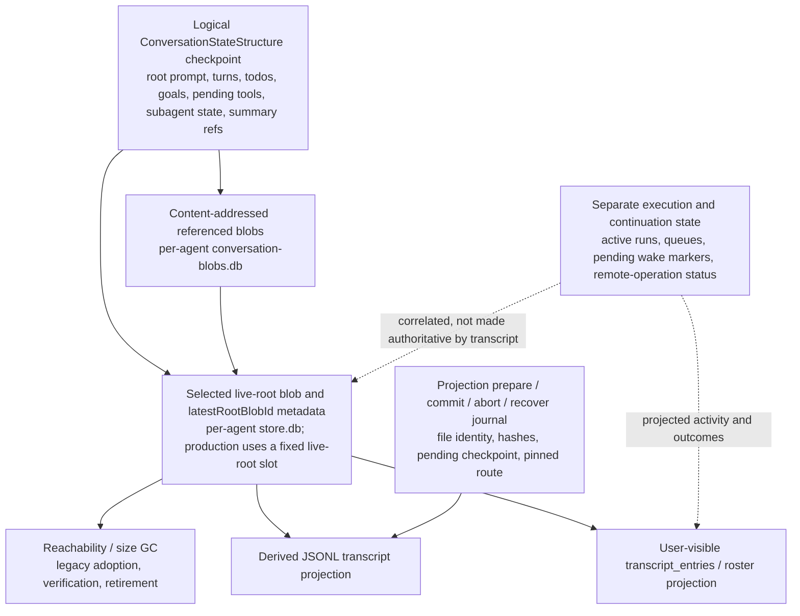
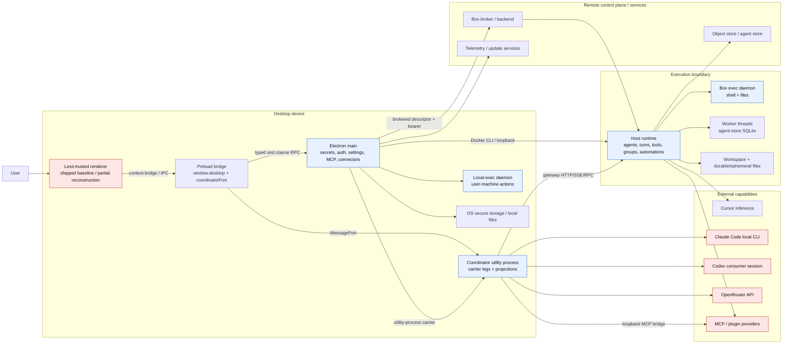

# Grok Bot 0.18 reconstructed architecture audit

Document status: **research comparison; post-challenger FIXER output; corrected findings require independent verification**

Audit mode: `FIX_EXTERNAL_REFERENCE_ARCHITECTURE_AUDIT`

Audit date: 2026-08-25

Primary repository: `/Users/richardzhu/dev/gork_bot`

External reference checkout: `/Users/richardzhu/dev/_external_refs/grok-bot-0.18-reconstructed`

External commit: `a9f633e09d49a85829b8236331b9e21f7e612634`

Authority rule: the primary repository remains the sole authoritative project state.

## 0. Post-challenger correction

This section records the author's bounded return as FIXER after the committed challenger review. It is intentionally explicit about what changed: the original audit overstated the transcript mirror, omitted four material patterns, mixed translated potential into some scores, and counted two source regions more than once. The corrected tables and conclusions below supersede the affected original wording; the challenger artifact and fixer handoff preserve the history. This correction does not select project architecture, authorize a spike, alter Stage 1, or make this research verified.

### 0.1 Correction disposition

| Finding | Independent source resolution | Result |
|---|---|---|
| `F-EXT-018-C-01` | The JSONL transcript is a derived, WAL-guarded projection. Canonical conversation state is a separately persisted conversation checkpoint with content-addressed referents, a selected live root, reachability, adoption, and retirement machinery. | **FIXED** |
| `F-EXT-018-C-02` | The cloud-agent boundary directly evidences launch/watch/reply/cancel and other lifecycle actions, environment targeting, background continuation, explicit destructive/review action sets, and mode-dependent review. | **FIXED** |
| `F-EXT-018-C-03` | The shared registry directly evidences stable operational error codes, domains, retryability metadata, allowlisted payload fields, and bounded emit tags, with important scope limitations. | **FIXED** |
| `F-EXT-018-C-04` | The summarization package directly evidences provider-aware context compaction, preserved tail messages, persisted summary/archive references, background staleness checks, and lossy/retention limits. | **FIXED** |
| `F-EXT-018-C-05` | A reproducible five-class rubric is now defined and every canonical pattern was re-evaluated. | **FIXED** |
| `F-EXT-018-C-06` | Each retained spike now has all 13 required fields, an explicit USD 0 external-spend cap, dependencies, and a decision rule. | **FIXED** |
| `F-EXT-018-C-07` | Thin channel structures are separated from mature group/A2A/automation evidence and classified `DEFER`. | **FIXED** |
| `F-EXT-018-C-08` | Content identity is separated from tenancy, authorization, deduplication, confidentiality, retention, and erasure; no global-dedup claim is made. | **FIXED** |
| `F-EXT-018-C-09` | All numeric cells were rescored as `EXTERNAL_IMPLEMENTATION_AS_EVIDENCED`; translated potential remains narrative only. | **FIXED** |
| `F-EXT-018-C-10` | Group-cap and threat-model citations were corrected; workflow/Finance and execution/Docker duplicate rows were consolidated. | **FIXED** |

### 0.2 Corrected state relationship

The source supports this relationship more accurately than the transcript-first chain in the original executive verdict:



**Verified facts.** `AgentStore2.handleCheckpoint` serializes the conversation checkpoint, writes it through the blob store, and updates `latestRootBlobId`; production supplies a fixed live-root slot while ordinary references use SHA-256 identities (`source/packages/agent-kv/agent-store.ts:346-355`; `source/packages/agent-kv/blob-store.ts:21-26`; `source/host/extensions/session/production.ts:166-183`; `source/host/extensions/session/session-paths.ts:9-12`). Root metadata, transcript entries, and legacy blobs are distinct tables/state (`source/host/extensions/session/agent-db.ts:177-197`; `source/host/extensions/session/agent-db-schema.ts:4-25`). Reachability is rooted from the selected conversation root, with conservative failure behavior and legacy adoption/retirement (`source/host/agent-isolation/conversation-blob-gc.ts:43-100`; `source/host/agent-isolation/conversation-blob-store.ts:11-19`; `source/host/extensions/session/session-maintenance.ts:57-73`).

Turn settlement prepares the projection checkpoint, persists canonical conversation state, then commits the JSONL projection; a canonical-state failure aborts the projection, while a post-state projection failure does not roll state back (`source/host/runner/turn-settle.ts:231-289`). The mirror worker opens the blob databases read-only and derives JSONL from a named state blob (`source/host/agent-isolation/transcript-mirror-worker.ts:18-25,60-95,117-135`). The UI-facing `transcript_entries` table is a separate projection and can be backfilled from canonical turns during recovery (`source/host/extensions/session/agent-db-schema.ts:15-25`; `source/host/extensions/session/session-maintenance.ts:52-65`). Active run ownership and pending background wakes are separate from transcript storage (`source/host/extensions/transcript/run-lifecycle.ts:29-43,152-179`; `source/host/extensions/transcript/sand-pending-wake-store.ts:11-18,111-191`).

The words *canonical transcript* inside the local mirror module describe that projection file's selected identity; they do not make JSONL authoritative task or application state. The source also does not prove that an append-only event log is canonical. Therefore:

- **Canonical conversation state** is the persisted `ConversationStateStructure` checkpoint plus resolvable referenced blobs.
- **Content-addressed storage** identifies ordinary referenced blobs; production's live root is a fixed slot selected by metadata, so the root itself must not be described as universally content-hashed.
- **Root pointer and reachability** select the live graph and bound collection; missing/unresolved references cause conservative GC failure.
- **Migration/adoption/retirement** copy legacy blobs, record adoption, verify a retained root, and only then retire the legacy table; this is not end-user erasure.
- **Transcript projection** is derived JSONL and a separate UI-facing SQLite projection; neither is automatically domain/task truth.
- **Projection journal/WAL** protects preparation, append, recovery, file identity, and migration-route ownership for the JSONL projection.
- **User-visible transcript** is a presentation/recovery surface and can be backfilled; it is not a substitute for every tool, task, or execution record.
- **Execution/task state** includes active ownership, queues, pending tools/wakes, remote lifecycle state, and terminal outcomes; some is canonical, some durable in separate stores, and some process-local. It must be modeled separately in a future design.

**Stage 3 design question, not a decision.** A future ADR must independently compare the relationship among (1) durable domain/task state, (2) canonical conversation/message state, (3) append-only event history, (4) user-visible conversation projections, and (5) execution trace. It must define authority, ordering, retention, replay, compaction, privacy, and reconciliation for each. This audit does not choose event sourcing, transactional state plus outbox, workflow history, a content-addressed graph, or any database.

### 0.3 Four material patterns added

1. **Canonical conversation checkpoint, blob graph, selected root, reachability, and migration — ADOPT the invariant.** Canonical state must remain distinguishable from projections; roots and referenced objects require integrity, recovery, reachability, retention, and migration rules. The external SQLite, protobuf, SHA-256, and fixed-slot choices are not selected.
2. **Remote/background-agent lifecycle with declared action classes — ADAPT.** The tool exposes launch, inspect, watch, reply/interrupt, cancellation request, rename, archive/unarchive, delete, artifact listing, transcript dump, and environment targets. Tool-facing states are `creating`, `running`, `finished`, `error`, `expired`, and `unknown`, with archived status separate (`source/host/cloud-agents/cloud-agent-tool.ts:4-41`; `source/host/extensions/cloud-agents/cloud-agents-service.ts:23-52`). `DESTRUCTIVE_ACTIONS` contains cancel/archive/unarchive/delete and `REVIEW_GATED_ACTIONS` contains launch/reply/rename plus those destructive actions. These are declared action classes, unlike name/description regex inference. However `confirm` is caller-supplied, the review callback is optional and `off|shadow|enforce` dependent, and lifecycle mutations lack complete terminal readback (`source/host/runner/sand-cloud-agent-auto-review.ts:19-310`; `source/host/runner/sand-auto-review.ts:3-68,113-167`). Background polling and local pending-wake re-arming show continuation after disconnect/restart, not a distributed workflow service (`source/host/extensions/cloud-agents/cloud-agent-poll-loop.ts:4-25`; `source/host/extensions/transcript/pending-wake-rearm.ts:22-216`). Future product contracts must use independent names and add tenant/actor/policy identity, idempotency, versioning, fencing, durable approval receipts, typed failures, retention/deletion, and verified terminal results.
3. **Stable operational error registry with leakage-bounded emit metadata — ADOPT the principle.** At this commit the registry defines 87 stable codes across registry, transport, auth, rebuild, agent, update, desktop, and storage domains. Definitions carry name, domain, retryable flag, summary, declared payload fields, and source provenance; unregistered codes become a safe fallback, and selected emit paths include only declared finite number/boolean or 1–64-character safe-token strings (`source/shared/errors/registry.ts:1-18,788-839`; `source/shared/errors/bounded.ts:1-48`). The constructors still accept arbitrary payload objects, and retryability is metadata rather than proof of retry policy. Provider/turn errors are classified for selected lifecycle/telemetry paths, while user-facing tray copy is derived separately (`source/host/extensions/transcript/turn-runtime.ts:182-211,482-506`; `source/host/extensions/transcript/agent-run-error.ts:178-195`). Separate structured-detail telemetry may include bounded raw messages/stacks (`source/host/extensions/telemetry/structured-log-telemetry.ts:190-220,603-623`). Client failure reports are validated at selected IPC/report boundaries (`source/electron-main/telemetry/client-failure-telemetry.ts:12-63`; `source/electron-main/telemetry/telemetry-report-pipes.ts:38-59`), but the source does **not** evidence a universal end-to-end process/protocol error serializer or round-trip contract; Electron-side duplicated maps can drift. Future requirements must separately cover provider, tool, task, authorization, sandbox, connector, refusal, retryable/terminal, user-action, and unknown-layer failures, with bounded public-safe payloads and controlled internal evidence references. This operational taxonomy is related to, but not identical with, the benchmark attempt taxonomy in `06_evaluation/MODEL_ROLE_BENCHMARK_PLAN.md:215-233`.
4. **Provider-aware LLM working-context compaction — ADAPT.** The pipeline partitions older prompt messages, preserves a tail, produces a summary carrier, adds continuity blocks, and may run in the background with prefix validation and stale-result discard (`source/packages/agent-summarization/pipeline.ts:86-125`; `source/packages/agent-summarization/summarization-handler.ts:930-973,1074-1122`; `source/packages/agent/summarization-orchestrator.ts:438-481,506-616`). On persistence it stores summarized non-summary messages and the summary carrier as blobs, pushes a `ConversationSummaryArchive`, replaces model working context, and appends messages that arrived during generation (`source/packages/agent/summarization-orchestrator.ts:675-811`). Ordinary summaries are model-generated; the deterministic builder is a fallback, not the normal authority. Input can be truncated or dropped, JSONL omits tool calls/results, and reachability GC intentionally does not traverse summary-archive references (`source/packages/agent-summarization/transcript-location.ts:20-38`; `source/host/agent-isolation/conversation-blob-gc.ts:10-14,43-100`). Summary/archive references are persisted but retention-scoped; summaries are derived, lossy working context, not authoritative history.

For the independent project, keep **LLM working context**, **durable conversation history**, **memory**, **execution history**, and **audit trail** as separate responsibilities. Compaction may reduce model input; it must not silently delete authoritative evidence. Finance research sources, thesis history, calculations, dataset/as-of versions, backtest evidence, policy/approval receipts, and portfolio/position/order/ledger state must never exist only as lossy LLM summaries.

### 0.4 Classification rubric and recount

The tie-breaker is whether the external semantic invariant can constrain later requirements without materially redefining authority, consistency, identity, or interface meaning.

| Class | Reproducible rule |
|---|---|
| **ADOPT** | The principle is strongly evidenced, directly useful, sufficiently general, and should constrain later design requirements without materially redefining its semantic invariant. Concrete technology and proprietary names still remain unselected. |
| **ADAPT** | The principle is useful, but the evidenced contract or authority/consistency model is materially tied to desktop, reconstruction, local-process, provider, or single-user assumptions and must be redesigned before it can constrain an implementation. |
| **EXPERIMENT** | The pattern is promising, but a named decision-relevant uncertainty cannot be resolved cheaply by analysis and requires a bounded, authorized technical spike with alternatives and a decision rule. |
| **REJECT** | The concrete pattern and its blueprint should not influence the intended design. A separately stated useful sub-principle may survive under another canonical pattern. |
| **DEFER** | The pattern may be useful, but it is not currently decision-relevant and need not constrain near-term architecture. |

Applying that rubric changes the canonical pattern counts from **ADOPT 6 / ADAPT 14 / EXPERIMENT 3 / REJECT 8 / DEFER 2 (33)** to **ADOPT 7 / ADAPT 15 / EXPERIMENT 2 / REJECT 7 / DEFER 3 (34)**. Typed port ownership remains ADOPT because its one-owner, explicit-boundary semantic carries without redefining authority; its coarse payloads and absent tenant authorization remain implementation gaps. The local transcript-projection WAL moves from ADOPT to ADAPT because it must remain subordinate to a separately chosen canonical-state and multi-writer contract. Canonical conversation state and the typed error-registry invariant are added as ADOPT. Cloud lifecycle and compaction are added as ADAPT. Channels move to DEFER. Finance-pack evidence is merged into the workflow-package pattern. The execution connector is counted once as ADAPT, with a local-development experiment and a production-isolation rejection recorded as sub-property dispositions rather than separate canonical patterns.

### 0.5 Multi-writer and multi-device requirement

The reconstruction has useful conflict evidence but remains substantially single-process. Box-store manifests carry `writerWindowId`, and canonical-write conflict handling rereads the winning manifest and records competing writers (`source/host/extensions/box-store-sync/box-store-manifest-format.ts:12-15`; `source/host/extensions/box-store-sync/box-store-manifest.ts:139-154`). By contrast, per-agent in-process queues can still race through a shared routed-transcript file across different agents (`source/node-agent-coordinator/inference-router.ts:61-78`). Neither proves a mature multi-device conversation/task consistency model.

Stage 3 must explicitly compare, without selecting one here:

- ordering scopes for conversation messages, task mutations, execution effects, and projections;
- tenant, actor, client/device, request/idempotency ID, causal parent, expected version, and schema version on mutations;
- simultaneous user/user, user/agent, and agent/agent messages without silent loss;
- optimistic concurrency or another explicit stale-write rule for consequential task state;
- execution ownership and stale-worker fencing separately from message ordering;
- duplicate delivery, edits/deletes, cancellation races, offline reconnects, cursor gaps, and explicit reconciliation;
- event-version compatibility, upcasting/replay, and preservation of original evidence; and
- cross-device resnapshot/resubscribe, revocation propagation, retention/deletion, and authoritative-state boundaries.

No final consistency architecture is selected.

### 0.6 Content-hash privacy, retention, and erasure boundary

**Verified fact.** The reconstruction uses deterministic SHA-256 identity for ordinary conversation referents and box-store files/packs. Production conversation blobs live in per-agent databases, and the live conversation root uses a fixed slot. Box-store client code exposes store/source namespaces, but the unrecovered backend's physical deduplication scope, tenant binding, encryption-at-rest, and purge behavior are unknown. Remote object adapters are append-only; clear/forget operations update manifests and do not prove physical purge (`source/packages/agent-kv/blob-store.ts:21-26`; `source/host/agent-isolation/conversation-blob-db.ts:13-18`; `source/host/extensions/box-store-sync/box-store-manifest-format.ts:2-15`; `source/host/extensions/box-store-sync/box-object-store.ts:186-193`).

Therefore `content addressed` does **not** mean `globally deduplicated across tenants`, and a digest proves neither authorization nor confidentiality. Future Stage 3 requirements must make explicit the tenant/workspace/key-domain namespace; plaintext-, ciphertext-, keyed/salted-, or opaque-identifier alternatives where appropriate; deduplication boundary; read/write/list/presign/existence authorization; hash-disclosure policy for manifests and exports; and reachability/lineage GC, retention, legal hold, deletion deadline, and purge evidence across loose objects, packs, snapshots, conflicts, quarantine, caches, replicas, and backups. Encryption does not eliminate an equality oracle if a deterministic plaintext fingerprint remains visible. Low-entropy private inputs and known confidential artifacts require presence-oracle and offline-fingerprinting threat tests. This audit prescribes no final cryptographic construction.

Finance Edition needs extra caution: dataset fingerprints, licensed inputs, research and thesis versions, model artifacts, strategies, calculations/backtests, positions, and portfolio state may themselves disclose highly sensitive information. Preserve authoritative lineage and chronology while controlling digest visibility, namespace, retention, and deletion.

## 1. Executive verdict

The external repository contains several patterns that should materially improve future design work, but it does **not** provide a production SaaS architecture to copy.

The corrected highest-value findings are:

1. **ADOPT the canonical-state invariant, not transcript-as-truth.** The external system persists a conversation checkpoint with content-addressed referents, a selected live root, conservative reachability, recovery, migration adoption, and retirement. JSONL and UI transcript tables are downstream projections. **DIRECTLY PRESENT IN SOURCE** (`source/packages/agent-kv/agent-store.ts:346-379`; `source/host/agent-isolation/conversation-blob-store.ts:11-19`; `source/host/extensions/session/session-maintenance.ts:52-73`; `source/host/runner/turn-settle.ts:231-289`).
2. **ADAPT its JSONL projection journal.** Hash-linked checkpoints, prepare/commit/abort/recover, atomic installation, file-identity checks, and pinned route ownership are valuable projection-consistency techniques. The local file/inode/fsync and single-host assumptions do not justify translating JSONL into a canonical event store. **DIRECTLY PRESENT IN SOURCE** (`source/host/transcript-mirror/transcript-journal-codec.ts:8-20`; `source/host/transcript-mirror/transcript-mirror.ts:23-42`; `source/host/transcript-mirror/transcript-mirror-router.ts:44-80,126-141`).
3. **ADOPT content identity, versioned manifests, conflict evidence, and hydration invariants—with an explicit privacy boundary.** Content addressing does not imply cross-tenant deduplication, authorization, confidentiality, or erasure. **DIRECTLY PRESENT IN SOURCE** (`source/host/extensions/box-store-sync/box-store-manifest-format.ts:1-19`; `box-store-manifest.ts:132-159`; `box-store-hydration.ts:5-13`; `box-object-store.ts:30-50,118-193`).
4. **ADOPT stable operational error identity and bounded emit metadata.** The shared registry supplies codes, domains, retryability metadata, allowlisted payload keys, safe fallbacks, and bounded tags. Its concrete codes are not our future taxonomy and do not replace durable task failures or the benchmark failure taxonomy. (`source/shared/errors/registry.ts:1-18,788-839`; `source/shared/errors/bounded.ts:1-48`).
5. **ADAPT remote/background operation lifecycle, declared action classes, approval scopes, provider seams, capability edges, context compaction, and execution connectors.** These are concrete and useful, but their identity, policy, durability, retention, and concurrency contracts remain local/provider-specific. (`source/host/cloud-agents/cloud-agent-tool.ts:4-41`; `source/host/runner/sand-cloud-agent-auto-review.ts:19-310`; `source/packages/agent-summarization/pipeline.ts:86-125`; `source/node-agent-coordinator/carrier.ts`; `source/host/extensions/local-tool-permission/local-tool-permission-controller.ts:20-86`).
6. **ADOPT the evidence-closure principle, while prioritizing only high-leverage artifacts.** Exact content digests, evidence anchors, explicit blockers, and generated interface checks are valuable. A manifest is admitted only when its authoritative inputs, owner, regeneration trigger, stale detection, automation, and failure consequence are defined; it is not proof merely because it exists. (`PROVENANCE.md:31-48`; `frontend/manifests/mermaid-public-package-closure.json:1-117`; `scripts/verify-publication-tree.mjs:14-42`).
7. **EXPERIMENT only through complete, zero-spend spike contracts.** The two canonical EXPERIMENT patterns are durable automation under distributed faults and cross-provider snapshot/hydration semantics. The local execution adapter remains an experiment sub-property of the ADAPT execution seam, while its production-isolation claim remains rejected.
8. **REJECT the inspected Docker invocation as production isolation and reject reconstruction compatibility mechanisms as clean-product architecture.** One fixed container, floating image, mounted consumer credentials, broad Electron/renderer bridges, minified patching, and local consumer sessions do not establish a multi-tenant SaaS boundary (`source/electron-main/box/local-docker-host-connector.ts:13-18,157-203,230-268`; `scripts/lib/router-renderer-patch.mjs:5-93`).

The external router is a valuable **prototype adapter study**, not a sufficient production router. It demonstrates provider substitution and tool-loop bridging, but its providers have materially different semantics; its setting is global; fallback is absent; errors are written as normal assistant messages; transcript storage is a bounded local JSON file; concurrency can lose updates across different agents; usage is non-authoritative; and Codex/Claude depend on local consumer sessions. The primary `MODEL_REGISTRY.yaml` and `MODEL_ROLE_BENCHMARK_PLAN.md` already set a substantially higher bar for exact identity, failure taxonomy, reproducibility, provider-specific differences, cost, false completion, external verification, and independent grading.

This report selects no architecture or technology, creates no ADR, advances no stage, changes no product strategy, and treats D-014 only as the current provisional shared-core/vertical constraint. Numeric scores are comparative evidence aids, not architecture decisions.

## 2. External repository identity and inspected commit

| Field | Inspected value | Evidence / confidence |
|---|---|---|
| Repository | `https://github.com/b-nnett/grok-bot-0.18-reconstructed.git` | Direct `git remote get-url origin`; **DIRECT**. |
| Commit | `a9f633e09d49a85829b8236331b9e21f7e612634` | Direct `git show -s HEAD`; **DIRECT**. |
| Commit date | `2026-08-23T21:52:48+01:00` | Direct commit metadata; **DIRECT**. |
| Commit subject | `Document project and preserve original installers` | Direct commit metadata; **DIRECT**. |
| Checked-out branch state | `main...origin/main`, no checkout changes under LFS-disabled status | Direct `git status` with LFS filters disabled; **DIRECT**. |
| Tracked paths | 2,111 | Direct `git ls-tree -r --name-only HEAD`; **DIRECT**. |
| Project identity | Unofficial source-oriented reconstruction, not the original monorepo or an official release | Repository claim (`README.md:5-24`); **CLAIMED**, consistent with provenance structure. |
| Rights boundary | No upstream source license is implied; independent rights review required before redistribution | Repository statement (`PROVENANCE.md:27-29`; `NOTICE.md:1-15`); **CLAIMED**. |
| Preserved macOS installer | Only the 134-byte Git LFS pointer was present locally; pointer OID `a253ccd8aab01e083f9812a0264354c5034d8ba7f0610bbb557e82ae77d203eb`, declared payload size 155,793,020 bytes | Direct Git blob inspection and LFS pointer; no payload downloaded; **DIRECT**. |

The reference was cloned outside the primary project with Git LFS smudging disabled. Because Git LFS was not installed, normal checkout initially reported a filter error; checkout was completed without fetching LFS content by disabling LFS process/smudge/required filters for `git restore`. No installer, DMG, ASAR, application binary, repository script, package lifecycle, build, test, provider login, or executable from the external tree was run.

Static commands used against the external tree were limited to Git metadata/tree reads and general-purpose file inspection (`rg`, `find`, `nl`, `sed`, `wc`, `du`, `jq`, and `git show/cat-file/ls-tree/status`). `jq` parsed checked-in JSON as data; it did not load project code. No source or asset was copied into the primary repository.

## 3. Evidence and confidence rules

External content was treated as untrusted input. Conclusions use these labels:

| Label | Meaning |
|---|---|
| **DIRECTLY PRESENT IN SOURCE** | A checked-in source contract, state transition, validation, or test directly implements the claim at the pinned commit. This proves only the reconstructed tree's code shape; it does not prove the code was original Grok Bot source, production-deployed, secure, or behaviorally equivalent. |
| **CLAIMED BY REPOSITORY DOCUMENTATION** | README, provenance, security, notice, or architecture documentation says the behavior exists. Claims were not dynamically executed. |
| **STRONG INFERENCE** | Multiple direct contracts and call paths support the conclusion, but dynamic composition, backend behavior, or deployment state was not available. |
| **UNKNOWN** | Static evidence cannot establish the fact, or the needed backend, installer, runtime, legal record, account, or operational data was absent. |

Additional rules:

- A module name in the reconstruction is not asserted to be the original Grok Bot module name (`README.md:22-24`).
- `frontend/` is used only to understand contracts and state surfaces; the repository itself calls it a partial reconstruction and retains the shipped renderer for packages (`README.md:48-64`). No UI, copy, bundle, CSS, image, or branding recommendation is derived from it.
- Documentation and source can disagree. Source controls conclusions about this checkout; neither controls the primary project's architecture.
- Passing type-checking, a build, or a source-regex check is not treated as behavioral or provenance proof. The external repository states the same provenance rule (`PROVENANCE.md:46-48`).
- Primary-project statements retain their repository classification. Stage 3/4 requirements are requirements and future process, not committed architecture (`MASTER_OPERATING_PROMPT.md:213-330`). Model assignments and production suitability remain hypotheses or unknowns (`01_governance/MODEL_REGISTRY.yaml:692-753`). D-014 is provisional (`01_governance/DECISION_LOG.md:270-345`).
- The primary task registry contains no READY or CLAIMED task for this audit, while the founder prompt authorizes only the three audit deliverables and forbids registry changes. This author output is therefore marked unverified and must receive a registered independent challenger/verifier review before any governance adoption.

## 4. External architecture map

### 4.1 Major processes and module boundaries

| Process or boundary | Direct responsibility in this checkout | State / transport | Evidence and confidence |
|---|---|---|---|
| Shipped/partial renderer | Presents roster, transcript, settings, approvals, computer, plugins, groups, and automations; consumes `window.desktop` and a coordinator port | Renderer state plus client-persistence slices; Electron bridge | `README.md:38-64,159-195`; `source/electron-preload/preload.ts:97-305`; **DIRECT + CLAIMED**. |
| Electron preload | Exposes attachment, account, plugin, secret, runtime, approval, update, telemetry, and coordinator-port methods | Context bridge and Electron IPC/main-edge calls | `source/electron-preload/preload.ts:97-305`; **DIRECT**. |
| Electron main | Owns app/window lifecycle, settings, auth, secrets, MCP lifecycle, remote/local connectors, updates, telemetry, VNC trust, and coordinator process | Electron IPC, message ports, filesystem, backend HTTP/RPC | `README.md:166-190`; `source/electron-main/main.ts:238-347`; `source/electron-main/main-production-services.ts`; **DIRECT**. |
| Node agent coordinator utility process | Brokers renderer/main/host legs; projects transcript/activity; hosts routed provider compatibility and OAuth/WebAuthn relays | Utility-process message ports plus loopback HTTP where needed | `source/electron-main/coordinator/production-provider.ts:431-469`; `source/node-agent-coordinator/carrier.ts`; `source/node-agent-coordinator/inference-router.ts`; **DIRECT**. |
| Remote box broker/control plane | Ensures/recreates a remote box and returns gateway/VNC descriptors and credentials | Authenticated Connect/HTTP network boundary | `source/electron-main/box/box-host-connector.ts:27-44,74-153`; `box-migration-watcher.ts:18-43`; **DIRECT**, backend semantics beyond the client are **UNKNOWN**. |
| Local Docker connector | Owns one named container, stages hashed runtime files, mounts local auth and persistent volumes, exposes loopback ports, checks readiness | Docker CLI, local files, HTTP loopback | `source/electron-main/box/local-docker-host-connector.ts:13-18,34-112,120-268`; **DIRECT**. |
| Host runtime | Owns agent lifecycle, sessions, transcript, tools, plugins, automation, group/A2A messaging, storage, execution bridges, and gateway | Local SQLite/files, worker threads, gateway HTTP/SSE/RPC | `source/host/`; `README.md:184-190`; **DIRECT** at module level. |
| Host gateway server | Exposes allowlisted commands, events, avatars, upgrade prep, local-exec and WebAuthn bridges | HTTP(S), bearer auth or loopback host restriction, SSE | `source/host/gateway-server.ts:21-23,28-57`; **DIRECT**. |
| Box execution daemon | Executes shell and file operations within configured workspace/terminal roots | Loopback Connect service; bearer; subprocesses | `source/box-exec-daemon/server.ts:80-98,191-216,255-299,409-488`; **DIRECT**. |
| Local execution daemon | Executes approved operations on the user's machine and bridges them to the host | Credential/discovery files, authenticated streaming bridge | `source/host/local-exec/local-exec-daemon-protocol.ts:13-92`; `source/host/local-exec/local-exec-provider.ts`; `source/local-exec-daemon/main.ts`; **DIRECT**. |
| Agent-store worker threads | Isolate SQLite handles and content-addressed conversation blob operations per database | Node worker threads and SQLite | `source/host/agent-isolation/agent-worker-pool.ts:88-185,263-343`; `conversation-blob-store.ts:9-20`; **DIRECT**; not a security boundary. |
| External model providers and local CLIs | Cursor remote inference, Claude Code CLI, direct Codex consumer session, OpenRouter API | Provider SDK/HTTP/SSE/local CLI | `source/host/extensions/inference/provider-session.ts:65-293`; **DIRECT** for client code; provider service behavior **UNKNOWN**. |
| MCP/plugin providers | Discover tools in desktop/host, execute via routed gateway or local MCP HTTP compatibility bridge | Desktop IPC, host gateway, MCP HTTP/stdio/backend connector | `source/electron-main/mcp/desktop-mcp-manager.ts:90-160`; `source/host/host-gateway-api.ts:141-163`; `source/node-agent-coordinator/routed-mcp-bridge.ts:39-88`; **DIRECT**. |

### 4.2 Process and trust-boundary diagram



This is an audit abstraction, not a claim that the upstream product used these exact names or deployment topology. **STRONG INFERENCE** follows from the explicit carrier, connector, gateway, and process-entry contracts. Backend implementation, remote VM/container isolation, service tenancy, and production network policy remain **UNKNOWN**.

### 4.3 Required architecture coverage map

| # | Topic | Evidence-backed reconstruction | Evidence class and key paths |
|---:|---|---|---|
| 1 | Major processes | Renderer, preload, Electron main, coordinator utility process, host, box-exec daemon, local-exec daemon, worker threads, remote backend/box, model and MCP providers | **DIRECT/STRONG INFERENCE**; process table above. |
| 2 | Major modules | Desktop lifecycle/auth/settings/secrets/MCP/connectors; coordinator carrier/router; host agents/runner/transcript/tools/storage/groups/automation; shared contracts | **DIRECT**; `source/electron-main/`, `source/node-agent-coordinator/`, `source/host/`, `source/shared/`. |
| 3 | Process boundaries | Context bridge, Electron IPC, transferable message ports, HTTP/SSE gateway, Connect RPC, worker threads, Docker, provider HTTP/CLI | **DIRECT**; `preload.ts:97-305`; `carrier.ts`; `gateway-server.ts:28-57`; `production-provider.ts:431-469`. |
| 4 | Trust boundaries | Top-frame checks, context isolation, bearer/loopback gateway, workspace containment, OS secure storage; weakened by unsandboxed Electron and broad bridge | **DIRECT**; `main.ts:190-196,244-246,304-310`; `main-edge.ts:63-70`; `protected-path-guard.ts:1-5`; `secret-store.ts`. |
| 5 | IPC/RPC boundaries | Large coordinator method table; only selected transcript messages receive deep parser validation; main edge often coerces to generic objects | **DIRECT**; `source/shared/rpc/coordinator.ts:28-89,92-181`; `source/electron-main/main-edge.ts:63-83`. |
| 6 | Network boundaries | Backend box broker, gateway HTTP(S)/SSE, loopback MCP, local Docker ports, update feeds, telemetry, model providers, OAuth/WebAuthn callbacks | **DIRECT**; `box-host-connector.ts:74-153`; `gateway-server.ts:21-57`; `routed-mcp-bridge.ts:39-88`; `update-feed.ts:4-34`. |
| 7 | Persistent state | Per-agent canonical conversation checkpoint with content-addressed referents and selected live root; separate transcript projections; settings, secrets, agent/group/workflow/automation files, box-store blobs/manifests, and lifecycle markers | **DIRECT**; `source/packages/agent-kv/agent-store.ts:346-379`; `source/host/extensions/session/agent-db-schema.ts:4-25`; `conversation-blob-store.ts:9-20`; `box-store-manifest-format.ts:1-19`. |
| 8 | Ephemeral state | Promise queues, active lanes, pending A2A messages, group epochs, approval maps, MCP bridge discovery, activity pulses, retry timers, in-flight migrations | **DIRECT**; `inference-router.ts:61,80-100,215-227`; `agent-to-agent-messaging.ts:38-48`; `local-tool-permission-controller.ts:39-42`; `box-migration-watcher.ts:53-76`. |
| 9 | Transcript/message flow | Canonical checkpoint state drives a guarded JSONL projection and a separate user-visible transcript-entry projection; routed providers also maintain a bounded compatibility overlay | **DIRECT**; `source/host/runner/turn-settle.ts:231-289`; `source/host/agent-isolation/transcript-mirror-worker.ts:117-135`; `source/host/extensions/session/agent-db-schema.ts:15-25`; `inference-router.ts:28-49,121-184,202-210`. |
| 10 | Agent lifecycle | Local persistent agents plus a distinct remote/background operation boundary with launch, watch, reply/interrupt, cancel, environment targeting, declared action classes, local wake re-arming, and typed tool-facing status | **DIRECT + UNKNOWN**; `source/shared/agents/agents.ts:19-65`; `source/host/cloud-agents/cloud-agent-tool.ts:4-41`; `source/host/extensions/cloud-agents/cloud-agents-service.ts:23-52`; backend tenancy and authorization **UNKNOWN**. |
| 11 | Turn lifecycle | Queue/accept, start activity, provider stream, tool loop, checkpoint, retry/resume, settle/final persist, cancellation/upgrade hooks | **DIRECT**; `inference-router.ts:121-184,212-228`; `runner/stream-attempt.ts:18-85,118-187`. |
| 12 | Tool-call lifecycle | Tool discovery, normalization, model request, gateway/MCP dispatch, result normalization, continuation; approval is not uniformly in the routed bridge | **DIRECT**; `routed-mcp-bridge.ts:39-88`; `codex-direct-responses.ts:100-182`; `host-gateway-api.ts:141-163`. |
| 13 | Model-provider routing | Global provider setting selects Cursor delegation or Claude/Codex/OpenRouter local routed path | **DIRECT**; `shared/inference-router.ts`; `inference-router.ts:187-228`; `provider-session.ts:203-293`. |
| 14 | MCP/plugin routing | Desktop/host discovery and execution are exposed to routed providers through direct tools or a secret loopback MCP endpoint | **DIRECT**; `desktop-mcp-manager.ts:90-160`; `routed-mcp-bridge.ts:39-88`. |
| 15 | Remote box lifecycle | Broker ensures box, returns gateway/VNC descriptors, supports recreate/force recreate, tracks operation IDs and migration stream offsets | **DIRECT client contracts**; `box-host-connector.ts:74-153`; `box-recreate-commands.ts:3-10`; `box-migration-watcher.ts:18-76`; backend implementation **UNKNOWN**. |
| 16 | Local Docker lifecycle | Inspect owned container, stage hashed host artifacts, replace on schema/hash mismatch, start/create, health wait, stop/restart/force-recreate | **DIRECT**; `local-docker-host-connector.ts:87-112,120-268`. |
| 17 | Secrets and authentication | OS encrypted storage or nonpersistent fallback; account scoping; backend bearer tokens; raw renderer reveal; local CLI auth and OpenRouter secret file/environment | **DIRECT**; `secret-store.ts`; `user-secrets-store.ts`; `secrets-ipc.ts:112-168`; `provider-session.ts:35-48,65-131`. |
| 18 | Failure recovery and error identity | Coordinator relaunch, gateway reconnect, migration reattach/watchdog, stream retry, transcript-projection WAL recovery, SQLite quarantine/salvage, box-store conflict readback, and a stable bounded operational error registry | **DIRECT**; `coordinator-runtime.ts:150-174`; `box-migration-watcher.ts:53-76`; `stream-attempt.ts:18-85`; `sqlite-recovery.ts:4-9`; `source/shared/errors/registry.ts:1-18,788-839`. |
| 19 | Migration behavior | Settings migration marker, account rescoping, transcript regime pinning, legacy blob adoption/retirement, workflow relocation, manifest v1/v2 and hydration handoff | **DIRECT**; `sand-settings-store.ts:93-107,134-146`; `transcript-mirror-router.ts:44-80`; `conversation-blob-store.ts:11-19`; `workflow-store.ts:52`; `box-store-manifest-format.ts:3-15`. |
| 20 | Observability/telemetry | Named events for turns, tools, queues, storage, automation, crashes, recovery, upgrades, local exec; privacy tiers, request lineage, drop reasons | **DIRECT**; `telemetry-events.ts:1-98`; `request-lineage.ts:1-10`; `sentry-privacy-mode.ts:1-3`. Runtime emission completeness **UNKNOWN**. |
| 21 | Automation scheduling | Five-field cron/aliases/time zones plus event/group triggers; per-agent definitions and run history; in-process serialized lifecycle, coalescing, bounded event queue | **DIRECT**; `automation-schedule.ts:1-19`; `automations.ts:1-10`; `automation-store.ts:12-80`; `automation-event-fires.ts`; `automation-runtime.ts`. |
| 22 | Group/channel behavior | Group storage caps normalized membership at six; no minimum-two source invariant was found. Group turns have no nesting and bounded rounds/messages/history. Channel evidence is limited to thin address/envelope structures and incomplete Slack/Discord surfaces. | **DIRECT + UNKNOWN**; `source/host/groups/group-store.ts:1-5`; `group-chat.ts:1-17`; `group-chat-orchestrator.ts:17-107`; `channels.ts:1-65`; `channel-messaging.ts:11-240`. The primary baseline reports observed two-to-six product behavior (`02_research/GROK_BOT_BASELINE_2026-08-21.md`, `GBF-016`), but that is not external code proof of a minimum. |
| 23 | File durability | Host-only exclusions, protected roots, content-addressed blobs, file/symlink modes, atomic markers, object size/concurrency limits, canonical manifest conflicts | **DIRECT**; `durable-file-policy.ts:1-6`; `protected-path-guard.ts:1-5`; box-store sources above. |
| 24 | Context compaction | Provider-aware summarization partitions older working-context messages, preserves a tail, persists summary/archive references, rejects stale background work, and replaces model input without making the summary an audit record | **DIRECT**; `source/packages/agent-summarization/pipeline.ts:86-125`; `source/packages/agent-summarization/summarization-handler.ts:930-973,1074-1122`; `source/packages/agent/summarization-orchestrator.ts:438-481,675-811`. |
| 25 | Content-address privacy/retention | Deterministic object identities and append-only remote stores are evidenced; backend dedup scope, encryption, tenant binding, and physical purge are not | **DIRECT + UNKNOWN**; `source/packages/agent-kv/blob-store.ts:21-26`; `source/host/extensions/box-store-sync/box-object-store.ts:186-193`; backend semantics **UNKNOWN**. |
| 26 | Packaging/update | Hybrid pinned renderer, deterministic patch, new bundle ID, ad-hoc signing, reconstructed updater/telemetry defaults off; separate update state machine supports verified downloads/signature checks | **CLAIMED + DIRECT**; `README.md:38-46,127-157`; `router-renderer-patch.mjs:35-93`; `update-download.ts:18-48`; `sand-update-service.ts`. |
| 27 | Testing/verification | Type checks, eight focused test files, editable frontend build, clean-history export check, large reconstruction manifests, optional packaging/smoke/verify scripts; Linux CI does not run package/smoke/verify or audit | **DIRECT**; `package.json:10-26`; `.github/workflows/check.yml:10-27`; `tests/`; `manifests/`; `frontend/manifests/`. |

## 5. Turn and tool-call sequence diagrams

### 5.1 Routed turn sequence

```mermaid
sequenceDiagram
  actor User
  participant Renderer
  participant Preload
  participant Coord as Coordinator router
  participant Store as Local routed transcript
  participant Host as Remote host/gateway
  participant Provider
  participant Tools as MCP/tool gateway

  User->>Renderer: Send prompt
  Renderer->>Preload: coordinator method sendPrompt
  Preload->>Coord: MessagePort RPC
  Coord->>Coord: Read global provider setting
  alt provider = Cursor
    Coord->>Host: Delegate sendPrompt
    Host-->>Renderer: Native transcript/activity events
  else provider = Claude/Codex/OpenRouter
    Coord->>Coord: Enqueue on in-memory per-agent promise lane
    Coord->>Host: Read remote transcript tail
    Coord->>Store: Load JSON and append user entry
    Coord-->>Renderer: Project appended user + synthesized activity
    Coord->>Host: List routed MCP tools
    Coord->>Provider: Provider-specific prompt/stream
    loop bounded tool steps
      Provider->>Tools: Tool call
      Tools->>Host: executeRoutedMcpTool(agentId, tool, args)
      Host-->>Tools: Provider result
      Tools-->>Provider: Normalized tool result
    end
    Provider-->>Coord: Text deltas / final result / usage
    Coord-->>Renderer: Project streaming assistant updates
    Coord->>Store: Append final assistant entry
    Coord-->>Renderer: Final assistant projection; activity false
  end
```

**DIRECTLY PRESENT IN SOURCE.** The local user entry is persisted before provider execution; the assistant entry is persisted only after a successful provider result (`source/node-agent-coordinator/inference-router.ts:121-184`). On a routed error, the queue catch creates a normal assistant transcript entry whose text begins `Router error:` rather than preserving a typed failed-turn state (`inference-router.ts:212-228`). This is a correctness and audit weakness. The per-agent lane serializes one agent, but every lane loads and rewrites the same JSON file (`inference-router.ts:61-78`), so turns on different agents can race and overwrite one another. That lost-update risk is a **STRONG INFERENCE** from the code; no concurrency test was found.

The 250ms activity pulse and 1.2-second delay are explicitly justified as adaptations for the fixed shipped renderer (`inference-router.ts:80-100,144-151`). They are reconstruction-specific UI projection, not legitimate distributed activity-state semantics.

### 5.2 Tool-call sequence

```mermaid
sequenceDiagram
  participant Model
  participant Adapter as Provider adapter
  participant Bridge as Routed MCP/direct-tool bridge
  participant Gateway as Host capability edge
  participant MCP as Desktop/host MCP manager
  participant External as External provider/API
  participant Transcript

  Model->>Adapter: Function/MCP call(name, arguments, call_id)
  Adapter->>Bridge: Normalized definition + raw arguments
  Bridge->>Bridge: Lookup tool; map schema/result
  Note over Bridge: Current read-only hint is inferred from name/description
  Bridge->>Gateway: executeRoutedMcpTool(agentId, providerIdentifier, toolName, args)
  Gateway->>MCP: Execute in connected provider context
  MCP->>External: Provider-specific call
  External-->>MCP: Result/error
  MCP-->>Gateway: Protobuf/provider result
  Gateway-->>Bridge: Routed result
  Bridge-->>Adapter: MCP content or function_call_output
  Adapter-->>Model: Continue bounded loop
  Model-->>Transcript: Final assistant output
```

**DIRECTLY PRESENT IN SOURCE.** The bridge has a 1 MiB body cap, a secret loopback path, tool list caching, protocol initialization, and result conversion (`source/node-agent-coordinator/routed-mcp-bridge.ts:39-88`). Codex preserves the provider `call_id`, rejects malformed argument JSON, returns unknown-tool and execution errors to the model, and bounds the loop at eight steps (`source/host/extensions/inference/codex-direct-responses.ts:100-182`). However, declaring `parallel_tool_calls: true` while executing returned calls sequentially is a semantic mismatch (`codex-direct-responses.ts:119-180`). More importantly, read-only/destructive/idempotent/open-world annotations are derived from a name/description regex (`routed-mcp-bridge.ts:16-20,67-70`) and do not enforce authorization. This must be rejected as a security classification mechanism.

## 6. Model-router analysis

### 6.1 Detailed findings

| Required aspect | What the external implementation does | Audit verdict and SaaS implication |
|---|---|---|
| Provider abstraction | Enumerates `cursor`, `claude-code`, `codex`, and `openrouter`; routes new `sendPrompt` calls based on one stored setting (`source/shared/inference-router.ts:1-25`; `source/node-agent-coordinator/inference-router.ts:187-228`). | **ADAPT.** The seam is useful, but a SaaS contract needs tenant, agent, turn, policy, capability, region, data class, budget, endpoint, model snapshot, and idempotency context. |
| Cursor versus routed providers | Cursor delegates to the remote coordinator path; non-Cursor providers maintain a local transcript overlaid onto remote transcript reads (`inference-router.ts:187-228`). | **REJECT the split-brain persistence model.** Every provider should write through whichever canonical conversation/message authority Stage 3 selects and feed a provider-neutral projection contract; this audit does not select the store or history model. |
| Claude Code | Locates the local CLI, flattens all messages into a role-labelled prompt, runs with the project root as CWD, allows only routed MCP tools, caps turns, disables session persistence, and emits only the final SDK result as one text delta (`provider-session.ts:51-57,203-228`). | **Desktop compatibility only.** It is not true token streaming, and local CLI authentication/execution is not a multi-tenant server provider. It may inform a local developer adapter test, not production identity. |
| Codex | Reads private `~/.codex/auth.json`, refreshes a ChatGPT token, reads local model/effort config, and calls `https://chatgpt.com/backend-api/codex/responses` directly (`provider-session.ts:65-150,167-200`). | **REJECT for production SaaS.** Local consumer-session reuse and a consumer backend endpoint violate the primary project's explicit separation between consumer access and supported public API access. Use only documented, contractually approved APIs after S0-005 evidence. |
| OpenRouter | Reads a key from environment or box secret file, constructs an OpenAI-compatible chat client, defaults to `openai/gpt-5.2`, and runs a bounded tool loop (`provider-session.ts:35-48,247-255`). | **ADAPT only as an adapter example.** Compatibility mode does not prove equivalent stop reasons, usage, tool semantics, retention, or model identity; this aligns with primary ambiguity MRA-004 (`MODEL_REGISTRY.yaml:706-708`). |
| Transcript persistence | Schema v2 JSON, per-agent arrays, user/assistant text plus rich text/reactions, last 200 entries per agent, mode `0600`, temp+rename (`inference-router.ts:10-44,63-78`). | **REJECT as SaaS persistence.** Missing tenant/event version/causal links/tool events/failure state/idempotent transaction/retention policy; 200-entry truncation loses audit context. Atomic rename does not prevent multi-lane lost updates. |
| Per-agent queueing | A `Map<agentId, Promise>` serializes routed turns for one process (`inference-router.ts:61,212-228`). | **ADAPT the invariant; EXPERIMENT with distributed implementation.** Use durable queue ownership, leases, generation fencing, dedupe keys, backpressure, and recovery. |
| Event projection | Converts local entries into the shipped renderer's `message`/`send-message` shapes and merges them into remote results (`inference-router.ts:46-50,202-210`). | **ADAPT the separation of authoritative state/history records from client views; reject the fixed renderer shapes.** The selected projection contract should be versioned and rebuildable. |
| Streaming | Codex and OpenRouter expose text deltas; Claude yields the final result as one delta; routed entries are projected as streaming updates (`provider-session.ts:175-200,203-228,247-255,271-293`; `inference-router.ts:156-180`). | **Insufficient normalization.** A contract must distinguish token delta, reasoning availability, tool call delta, final message, usage finalization, cancellation, and partial failure without pretending providers are equivalent. |
| Activity state | Fetches remote roster, overrides one agent as thinking, pulses every 250ms, and waits 1.2 seconds before streaming (`inference-router.ts:80-100,144-151`). | **REJECT as runtime state.** Represent lifecycle in durable typed state/history records and derive client status; never use UI timing as source of truth. |
| Tool definition normalization | Accepts name/description/input schema; Codex uses `strict:false`; OpenRouter wraps JSON Schema (`provider-session.ts:153-165,230-245`; `codex-direct-responses.ts:100-109`). | **ADAPT.** Add schema version/digest, stable capability ID, side-effect and idempotency declarations signed by the tool owner, output schema, auth scope, data class, and compatibility validation. |
| Tool execution | Direct adapters call the remote routed tool executor; Codex loops up to eight times and converts errors into tool outputs (`inference-router.ts:166-180`; `codex-direct-responses.ts:111-182`). | **ADAPT with a capability gateway.** Require policy decision, approval receipt, idempotency, deadline/cancellation, external readback, and audit before/after every consequential call. |
| MCP bridging | Claude receives a secret loopback HTTP MCP server; direct providers receive tool definitions and an executor (`inference-router.ts:162-180`; `routed-mcp-bridge.ts:39-88`). | **ADAPT.** The SaaS analogue is a tenant-aware capability gateway, not a secret URL. |
| Provider errors | Provider errors propagate to the queue catch, which appends a normal assistant message and returns an already accepted send (`inference-router.ts:212-228`). | **REJECT.** Persist a typed failed/cancelled/retryable turn state, preserve provider error class and raw reference, and let the client render failure separately. |
| Local usage tracking | Adds provider request/token counters to a settings JSON file; README says figures are activity records, not invoices (`sand-settings-store.ts:158-168`; `README.md:97-99`). | **ADAPT only for local diagnostics.** SaaS metering must use provider receipts, request IDs, pricing version, infrastructure/tool charges, reconciliation status, and immutable cost records. Current load-modify-save is also race-prone. |
| Settings storage | One versioned settings document holds provider, box runtime, usage, MCP choices, permissions, and migrations; unknown versions reset to defaults (`sand-settings-store.ts:45-107,134-168`). | **REJECT as multi-tenant configuration storage.** Use versioned tenant/org/user/agent policy layers with transactional migrations and explicit incompatible-version handling. |
| Provider switching | Each dispatch reads the global provider before enqueueing; queued execution captures that provider (`inference-router.ts:187-228`). | **Weak.** A turn must persist requested and resolved provider/model/config, policy decision, and change boundary. Agent and workflow policy may differ; global switching is insufficient. |
| Fallback behavior | None in routed providers; Cursor is simply the default. Errors do not trigger a separate provider configuration. | **UNKNOWN/ABSENT by source inspection.** This is preferable to hidden fallback, but production needs an explicit, separately benchmarked fallback policy. Primary benchmark rules already require fallback to be a distinct configuration (`MODEL_ROLE_BENCHMARK_PLAN.md:231-233,338`). |
| Concurrency | One agent is serialized; different agents run concurrently and can write the shared JSON/settings files concurrently; Codex announces parallel tool calls but executes sequentially. | **Insufficient.** Test one-agent ordering, cross-agent file transactions, provider rate limits, tool idempotency, cancellation, and distributed worker fencing. |

### 6.2 Comparison with the primary model registry and benchmark plan

The external router provides **implementation evidence** the primary project does not yet have: an adapter seam, a direct SSE parser, bounded tool loops, a local provider bridge, and a concrete transcript projection. It therefore supplies useful Stage 4 fixture ideas.

The primary project is already stronger in the dimensions that matter for selection and production:

- `MODEL_REGISTRY.yaml` separates `CONSUMER_PRODUCT_ACCESS`, `PUBLIC_API_AVAILABILITY`, `FOUNDER_ACCOUNT_ACCESS`, and `PRODUCTION_SUITABILITY`; the external Codex path collapses consumer login into provider access.
- The benchmark plan requires run/attempt IDs, exact candidate and grader configuration, fixture/harness/grader hashes, seeds, timing, usage, itemized cost, raw-evidence digest, normalized outcome, failure taxonomy, rerun linkage, and verifier status (`MODEL_ROLE_BENCHMARK_PLAN.md:119-145`). The external local usage document contains only aggregate counters.
- The primary taxonomy separates access, harness, transport, capacity, policy, model, tool/environment, grader, and unknown-layer failures (`MODEL_ROLE_BENCHMARK_PLAN.md:215-233`). The routed coordinator reduces all provider failures to assistant text.
- Primary hard gates cover false completion, cross-tenant/secret/authorization failures, cost, exact identity, bounded retries, and independent verification (`MODEL_ROLE_BENCHMARK_PLAN.md:247-329`). The external tests do not approach this coverage.
- Primary rules explicitly preserve provider-specific limitations rather than normalizing them away (`MODEL_ROLE_BENCHMARK_PLAN.md:188-205`). That is the correct constraint for a future provider contract.

Potential benchmark-harness reuse should be independent and limited to test ideas: truncated SSE, exact call-ID propagation, malformed tool arguments, unknown tools, bounded step exhaustion, mid-stream provider failure, usage reconciliation, streaming/final projection consistency, provider-switch boundaries, and crash-after-user-before-assistant recovery. No external code should be imported.

## 7. Local and remote execution analysis

### 7.1 Boundary reconstruction

The reconstruction has a valuable **connector seam**, but it does not have one uniform security model.

| Layer | Directly present behavior | Boundary assessment |
|---|---|---|
| Desktop client | Selects and wraps a host connector, synchronizes settings/secrets, exposes status and recovery controls, and forwards IPC to the coordinator (`source/electron-main/main-production-services.ts:343-347,632-709`). | Trusted desktop control plane. It carries user authority and should not be confused with an untrusted workload boundary. |
| Remote box connector | Obtains box connection information, opens authenticated coordinator/gateway channels, and exposes recreate/credential operations (`source/electron-main/box/box-host-connector.ts:38-44,74-153`). | Useful port shape; remote identity, tenancy, authorization, regional policy, and attestation remain outside the connector abstraction. |
| Local Docker connector | Creates one named container, publishes loopback ports, mounts reconstructed runtime trees by content digest, attaches persistent volumes, and mounts local Codex/Claude configuration read-only (`source/electron-main/box/local-docker-host-connector.ts:13-18,157-203,230-268`). | Reproducible developer convenience, not a production isolation boundary. |
| Gateway | Serves authenticated HTTP/SSE routes and multiplexes host/coordinator functionality (`source/host/gateway-server.ts:21-57`). | Protocol boundary is explicit, but bearer possession is coarse authority and the topology is single-user/loopback-oriented. |
| Box execution daemon | Validates an expected workspace root, rejects traversal and symlink escape, then invokes `/bin/sh -lc` within the accepted workspace (`source/box-exec-daemon/server.ts:31-77,95-174`). | Path checks are useful defense in depth. Shell execution is intentionally powerful and therefore requires a real sandbox, capability policy, resource controls, and egress policy around it. |
| Local execution daemon | Defines a local execution entry point plus an authenticated host protocol and pending tool-approval state (`source/local-exec-daemon/main.ts`; `source/host/local-exec/local-exec-daemon-protocol.ts:13-92`; `source/host/local-exec/local-tool-approvals.ts`). | A good control/execution separation pattern for trusted local use; approval memory and host identity are not tenant authorization. |
| Durable store | Uses versioned file/symlink manifests, content-addressed objects, canonical-write conflict detection, hydration handoff markers, and restore evidence (`source/host/extensions/box-store-sync/box-store-manifest-format.ts:1-20`; `source/host/extensions/box-store-sync/box-store-manifest.ts:132-161`; `source/host/extensions/box-store-sync/box-object-store.ts:30-50,118-193`; `source/host/extensions/box-store-sync/box-store-hydration.ts:5-13`). | Strong pattern to adopt at the contract level, with tenant-scoped encryption, retention, attestations, and transactional metadata in SaaS. |

The remote and local implementations satisfy a common *shape*—connect, expose gateway/coordinator endpoints, report status, and offer recovery—but not a documented common security or durability contract. That makes the seam an **ADAPT**, not evidence that the implementations are interchangeable.

### 7.2 Lifecycle, durability, and recovery

- **DIRECTLY PRESENT IN SOURCE — durable file identity.** File records distinguish files and symlinks, objects may be addressed by content identity, and versioned manifests with canonical-write conflicts detect stale writers (`source/host/extensions/box-store-sync/box-store-manifest-format.ts:1-20`; `source/host/extensions/box-store-sync/box-object-store.ts:30-50,118-193`; `source/host/extensions/box-store-sync/box-store-manifest.ts:132-159`). This is materially stronger than treating a mutable workspace directory as the recovery source of truth.
- **DIRECTLY PRESENT IN SOURCE — hydration evidence.** Hydration evidence counts manifest entries, files, verified objects and failures; the handoff marker is written with file and directory synchronization (`source/host/extensions/box-store-sync/box-store-hydration.ts:5-13`; `source/host/extensions/box-store-sync/box-store-manifest.ts:120-161`). This supports independent restore verification if enriched with tenant, policy, producer, environment, and encryption identities.
- **DIRECTLY PRESENT IN SOURCE — pause/recreate visibility.** Pausing blocks connector use and tears down egress; recreate commands have typed outcomes and operation IDs (`source/electron-main/box/box-client-pause.ts:1-62`; `source/electron-main/box/box-recreate-commands.ts:4-9`). The watcher tracks operation ID, migration phase, resume offset, reconnect, and watchdog state (`source/electron-main/box/box-migration-watcher.ts:18-76`). This is a useful long-running-operation contract.
- **DIRECTLY PRESENT IN SOURCE — stream recovery.** A stream attempt tracks checkpoint and retry state, controls retryability, and settles a final result (`source/host/runner/stream-attempt.ts:18-85,118-187`). It is an important correctness pattern, though provider and tool side effects still need idempotency semantics.
- **DIRECTLY PRESENT IN SOURCE — database recovery.** Corrupt SQLite state is quarantined and salvage is attempted rather than silently overwritten (`source/host/storage/sqlite-recovery.ts`). The conversation blob store separates content-addressed payload storage and garbage-collection concerns (`source/host/agent-isolation/conversation-blob-store.ts`; `source/host/agent-isolation/conversation-blob-gc.ts`).
- **STRONG INFERENCE — recovery is primarily single-host.** Several locks, queues, approvals, and lifecycle guards are in-memory. No distributed lease, fencing token, tenant quota authority, or cross-region recovery protocol was found in the inspected contracts. The mechanisms are therefore good local correctness patterns, not proof of horizontally distributed durability.

### 7.3 Proposed independent execution-provider contract

This is a Stage 3 ADR candidate, not an architecture selection. A future provider-neutral interface should make the following concerns explicit:

1. `ExecutionContext`: tenant, organization, principal, agent, task/turn, data classification, region, policy version, budget, and trace identifiers.
2. `Provision`: immutable runtime/image reference, dependency and policy digests, workspace source, requested resources, network class, and expiration.
3. `Attest`: observed image/runtime digest, policy/enforcement version, isolation class, boot identity, and health evidence.
4. `Lease`: owner, generation/fencing token, expiry, renewal, and takeover rules.
5. `Execute`: typed operation, capability grant, idempotency key, deadline, resource budget, input digests, and expected output schema.
6. `Cancel` and `Interrupt`: acknowledged versus best-effort semantics, with terminal readback.
7. `Snapshot`/`Restore`/`Recreate`: immutable snapshot identity, source generation, operation ID, resume cursor, verification result, and data-loss boundary.
8. `EgressPolicy`: default deny/allow rules, destination and protocol constraints, DNS behavior, logging, and time-bounded exceptions.
9. `CredentialLease`: brokered capability, scope, recipient/runtime identity, non-exportability where possible, expiry, rotation, and revocation.
10. `Observe`: append-only lifecycle/audit events, usage, tool/network activity, failure class, and evidence references.
11. `ReadBack`: externally verify consequential state before reporting completion.
12. `Terminate`/`Erase`: explicit retention and cryptographic/data deletion evidence.

This contract generalizes the external connector, operation-ID, checkpoint, content-addressed state, and visibility patterns without inheriting Electron, local-home-directory, or fixed-container assumptions.

### 7.4 Sufficiency of the local Docker approach by deployment class

Scores below are contextual suitability judgments, not a claim that Docker itself always has the stated score.

| Deployment class | Suitability | Explanation |
|---|---:|---|
| Single-user local development | **4/5** | Loopback publication, read-only runtime/config mounts, a content-addressed reconstructed runtime, and persistent volumes are convenient for a trusted developer (`local-docker-host-connector.ts:157-203,230-268`). It still needs pinned image digests, cleanup, resource limits, and safe test credentials. |
| Private prototype | **3/5** | Conditionally adequate for trusted operators and non-sensitive/synthetic data. The fixed container identity, floating/configurable image reference, host credential mounts, and absent explicit egress/resource hardening impose a narrow risk envelope. |
| Multi-tenant SaaS | **1/5** | No tenant scheduling boundary, distributed ownership, per-tenant policy, workload identity, quota enforcement, attestation, network policy, or verified erasure is provided by this connector. |
| Untrusted customer workloads | **1/5** | A normal container around shell/tool execution is not sufficient evidence of isolation. The inspected run arguments do not establish rootless execution, capability dropping, read-only root, seccomp/AppArmor policy, per-job identity, or VM-grade boundary (`local-docker-host-connector.ts:157-203`). |
| Finance Edition | **2/5 overall** | It can support synthetic local research fixtures, so it is not useless. It is insufficient for live credentials, regulated/sensitive data, reproducible production research, or paper-trading controls without point-in-time datasets, immutable environment/data/model identities, approval policy, network controls, and reconciliation evidence. For live or customer-sensitive finance work the effective score is **1/5**. |

The recommendation is therefore: **EXPERIMENT** with a local-development adapter, **REJECT** it as a production isolation design, and **ADAPT** the connector interface into an execution-provider contract.

## 8. Agent, group, channel, and automation analysis

### 8.1 Agents and isolation

**DIRECTLY PRESENT IN SOURCE.** Agents are persistent named records with bounded counts and per-agent state; the shared schema and profile modules cover identity and runtime-facing data (`source/shared/agents/agents.ts:19-65`; `source/host/agents/agent-profile.ts`). Agent work is scheduled through process-local lanes (`source/host/extensions/transcript/run-scheduler.ts`). Background worker threads isolate agent-store work from the event loop (`source/host/agent-isolation/agent-worker-pool.ts:88-185,263-343`).

The boundaries are useful for modularity but incomplete for security:

- An agent ID is a routing/state key, not proof of tenant or principal authorization.
- A per-agent queue is an ordering primitive, not durable distributed ownership.
- A worker thread is a fault/performance boundary, not a hostile-code security boundary.
- Per-agent files give convenient local partitioning, not encryption or tenant isolation.
- Tool permissions and secrets need independent capability checks at execution time; prompt instructions cannot carry that burden.

**Recommendation: ADAPT.** Preserve explicit agent identity, state version, execution generation, private context, approved shared contexts, tool/capability grants, routine bindings, owner/organization, and audit stream as separate contracts.

### 8.2 Groups, delegation, and agent-to-agent messaging

The group runner is deliberately bounded: group storage caps normalized membership at six (`source/host/groups/group-store.ts:1-5`), while turn orchestration imposes round/message/history limits; nested groups are rejected and private scratch context is not automatically shared (`source/host/groups/group-chat.ts:1-17`; `source/host/extensions/transcript/group-chat-orchestrator.ts:17-107`). This is a strong product-safety and cost-control pattern. No minimum-two invariant was found in those source files.

The agent-to-agent layer maintains pending work in memory, gives priority messages precedence over non-user work, and separates group coordination from ordinary turns (`source/host/extensions/transcript/agent-to-agent-messaging.ts:38-48`; `source/host/extensions/transcript/group-chat-orchestrator.ts:17-107`). This demonstrates an important distinction between user turns, delegated work, and group coordination, but it is not a durable delivery system. Crash recovery, delivery ID, deduplication, acknowledgement, causal parent, delegation authority, owner visibility, budget transfer, and terminal outcome are absent or not evidenced.

For an independent implementation, distinguish:

| Contract | Minimum independent fields |
|---|---|
| Delegation | tenant, delegator, delegate, parent task/turn, requested outcome, capability subset, budget, deadline, context references, approval policy, idempotency key |
| Agent message | durable message ID, sender/recipient, causal parent, channel/group, payload schema, visibility, data class, delivery/acknowledgement state, trace ID |
| Group policy | membership and role version, turn/round/message/token/tool/cost limits, moderator/coordinator rule, shared-context allowlist, stop conditions |
| Shared workspace | explicit workspace ID, owner, membership, path/object capabilities, writer generation, snapshot lineage, retention and audit policy |

Bounded group orchestration is **ADAPT**; in-memory delivery is **REJECT as durability**, while priority and explicit message classes should inform a durable queue design.

### 8.3 Channels

The shared channel contracts are small—platform/chat identity and message envelopes—and the inspected frontend evidence marks Slack/Discord connection surfaces as coming-soon/incomplete (`source/shared/channels.ts:1-65`; `source/shared/channel-messaging.ts:11-240`; `frontend/manifests/conversation-evidence.json`). Any behavioral authorization that exists primarily as a prompt or display policy is insufficient.

**Observed external contribution:** thin channel/message structures only. **Not evidenced:** mature multi-agent group routing through external channels, production connector completeness, or a service-grade inbound/outbound channel lifecycle. The group runner, A2A delivery, automations, and channel types are separate observations and must not be combined into a claim of mature channel architecture.

**Classification: DEFER.** The inspected code does not establish a production-grade inbound/outbound envelope with tenant binding, provider event ID, signature verification result, replay protection, sender authorization, thread/message identity, edit/delete semantics, attachment provenance, delivery idempotency, rate-limit state, or external readback. Those are future SaaS requirements derived from product/security needs, not reusable substance proven by these thin files. Stage 3 should design the channel contract from selected workflows and requirements, separating transport receipt, policy decision, agent action, outbound attempt, and confirmed external result.

### 8.4 Automations and routines

**DIRECTLY PRESENT IN SOURCE.** Automation records support cron schedules plus grouped event listeners; parsers cover Slack, GitHub, Microsoft Teams, Linear, Sentry, and PagerDuty shapes, and preserve schedule normalization (`source/shared/automations.ts`; `source/shared/automation-schedule.ts`; `source/host/automations/automation-trigger.ts:1-12`; `source/host/automations/automation-store.ts:39-69`). Run-path, event-fire, and runtime modules carry firing/lifecycle state and coalescing behavior (`source/host/extensions/transcript/automation-run-path.ts`; `source/host/extensions/transcript/automation-event-fires.ts`; `source/host/extensions/transcript/automation-runtime.ts`).

This is a useful domain separation—trigger specification, stored configuration, firing, run history, and execution are not one object. However, locks, overlap guards, and queues are primarily process-local. A SaaS scheduler also needs durable trigger receipts, signed webhook verification, dedupe windows, exactly-once-*effect* strategy rather than impossible exactly-once delivery claims, lease/fencing, misfire policy, catch-up policy, concurrency keys, tenant budgets, pause/kill switches, approval requirements, and replayable policy decisions.

The routine/workflow layer unifies user, managed, plugin, and automation-provided workflows and supports per-agent enablement (`source/host/workflows/workflow-store.ts`; `source/host/workflows/workflow-library.ts`; `source/shared/workflows.ts`). This is the best candidate for a General/Finance vertical-pack boundary, but executable helper content must become signed, versioned, capability-declared packages rather than trusted files.

### 8.5 Comparison with planned product requirements

The primary requirements call for persistent named agents, teams, group conversations, agent-to-agent messaging and delegation, ownership, skills/routines, scheduled/event triggers, shared versus private context, isolation, explicit shared workspaces, and auditability. These remain requirements/hypotheses, not selected architecture (`MASTER_OPERATING_PROMPT.md:213-265`; `DECISION_LOG.md:270-345`).

| Requirement | External contribution | Gap to carry into Stage 3 |
|---|---|---|
| Persistent named agents | Concrete identity/state/store boundaries | Tenant/org owner, lifecycle version, retention, export/delete, policy binding |
| Multi-agent teams/groups | Bounded rounds, messages, membership, no nested groups | Durable coordinator state, role/capability delegation, replay, cost and stop evidence |
| A2A messaging | Separate priority and delivery surface | Durable envelope, acknowledgement/dedupe, causal graph, authorization and budget transfer |
| Skills/routines | Unified workflow sources and per-agent enablement | Signed package identity, dependency closure, capability manifest, review/revocation |
| Scheduled/event triggers | Typed trigger union, cron normalization, run history | Distributed leases, webhook verification, misfires, idempotent effects, tenant budgets |
| Shared/private context | Private scratch rule and bounded shared history | Object-level visibility and provenance, explicit sharing grants, revocation, leakage tests |
| Workspaces | Content-addressed durable file model | Tenant encryption, conflict policy, explicit agent grants, malware/DLP hooks, retention |
| Auditability | Rich lifecycle/telemetry and local histories | Immutable tenant audit events, policy/approval receipts, external readback and verifier status |

## 9. Desktop security-boundary analysis

This is a static threat-model input, not a vulnerability certification. No dynamic exploitation was performed.

### 9.1 What is sound or promising

- **Renderer separation.** Main windows use `contextIsolation: true` and `nodeIntegration: false`; navigation/window-open policy is restricted (`source/electron-main/main.ts:190-196,304-340`). These are sound Electron baselines.
- **Explicit preload API.** Renderer access is mediated through a named bridge rather than arbitrary Node APIs (`source/electron-preload/preload.ts:97-305`; `source/electron-main/production-ipc-contract.ts`). An explicit bridge is auditable even though this particular surface is too broad.
- **Top-frame checks.** Sensitive coordinator/secret IPC paths include top-frame guards (`source/electron-main/main-edge.ts:63-70`; `source/electron-main/secrets/secrets-ipc-guard.ts`).
- **Local secret encryption.** The user-secret store uses Electron `safeStorage` when available and protects relevant files with restrictive modes; it does not log plaintext by design (`source/electron-main/secrets/user-secrets-store.ts:25-43,68-128`).
- **Deep-link parsing.** Deep links are parsed through a constrained controller and are queued until the application is ready (`source/electron-main/deep-link/deep-link-controller.ts:1-14`).
- **WebAuthn consent/cancellation.** WebAuthn proxy/provider modules separate gateway state, signing/provider work, and availability/lifecycle handling (`source/node-agent-coordinator/webauthn/provider.ts`; `source/node-agent-coordinator/webauthn/signer.ts`; `source/host/extensions/webauthn-proxy/webauthn-proxy-bridge.ts`; `source/shared/webauthn-gateway.ts`).
- **Workspace containment.** Execution paths resolve and validate roots and reject symlink escape before shell execution (`source/box-exec-daemon/server.ts:31-77`).
- **Loopback credentials and body caps.** Gateway/bridge services use host restrictions, secret paths/bearers, and bounded request bodies (`source/host/gateway-server.ts:21-57`; `source/node-agent-coordinator/routed-mcp-bridge.ts:39-88`).

These controls should inform defense in depth; none establishes tenant isolation by itself.

### 9.2 Desktop-specific and reconstruction-specific risks

| Finding | Evidence | Assessment |
|---|---|---|
| Chromium sandbox disabled | Main preferences set `sandbox: false`, the application appends `no-sandbox`, and box VNC webviews are selectively unsandboxed (`source/electron-main/main.ts:190-196,244-246,304-310`; `source/electron-main/vnc/vnc-trust.ts:18`). | **REJECT as a security blueprint.** This enlarges renderer-compromise impact. It may be compatibility-driven, but the cause does not remove the risk. |
| Webviews enabled | Main-window preferences enable `webviewTag` (`source/electron-main/main.ts:190-196,304-310`). | Requires extremely narrow navigation, partition, permission, and preload policy. It has no clean SaaS analogue. |
| Broad preload bridge | The bridge exposes account, settings, local execution, MCP, plugins, runtime switching, downloads, and secret operations (`source/electron-preload/preload.ts:97-305`; `source/electron-main/production-ipc-contract.ts`). | Method enumeration is good; breadth and coarse argument typing make renderer compromise consequential. Split by capabilities and validate exact schemas. |
| Plaintext secret reveal to renderer | `sand:secrets-reveal` is in the production IPC contract, and the store supports reveal (`production-ipc-contract.ts:17`; `source/electron-main/secrets/user-secrets-store.ts:84-90`). | **REJECT for SaaS and minimize even on desktop.** Prefer non-exportable broker use; never return raw provider secrets to a general UI context. |
| OS-encryption fallback | When encrypted storage is unavailable, behavior includes a memory-only/fallback path (`source/electron-main/secrets/user-secrets-store.ts:44-67`). | Acceptable only with explicit degraded-mode UX and no silent durable plaintext. SaaS requires a centralized encrypted vault and broker. |
| Local home auth mounted/read | Docker mounts local Codex/Claude homes read-only, and provider adapters reuse local sessions (`source/electron-main/box/local-docker-host-connector.ts:184-197`; `source/host/extensions/inference/provider-session.ts:65-150,203-228`). | Desktop convenience only. It is incompatible with tenant-scoped service identity and least-privilege credentials. |
| Box secrets injected into runtime synchronization | The desktop resync path pushes box secrets and the shared contract defines secret transfer state (`source/electron-main/coordinator/coordinator-resync.ts:7`; `source/shared/box-secrets.ts`). | Broad runtime injection risks process inheritance and accidental logging. Use short-lived scoped delivery to the target capability. |
| RPC schemas are often coarse | The coordinator method table exists, but some boundaries still coerce generic objects (`source/shared/rpc/coordinator.ts:28-181`; `source/electron-main/main-edge.ts:63-83`). | Interface inventory is useful; production trust boundaries need exact runtime validation, versioning, authorization, and limits per method. |
| Mixed action classification | The routed MCP bridge infers read-only safety from name/description regexes, while the cloud-agent tool declares exact destructive and review sets (`source/node-agent-coordinator/routed-mcp-bridge.ts:16-20,67-70`; `source/host/cloud-agents/cloud-agent-tool.ts:4-28`). | **REJECT the heuristic; retain the declared-metadata principle.** Human-language labels are not authority. Typed source-owned action classes are stronger, but the cloud review callback is optional/mode-dependent and still needs server authorization and durable receipts. |
| Loopback bearer as broad authority | Secret URLs/bearers protect local services (`routed-mcp-bridge.ts:39-88`; `source/box-exec-daemon/server.ts:95-174`). | Appropriate local defense, insufficient for tenant, actor, action, resource, approval, and expiry authorization. |
| Docker defaults | The local connector does not evidence rootless execution, dropped capabilities, seccomp/AppArmor, read-only root, resource quotas, or default-deny egress (`local-docker-host-connector.ts:157-203`). | **REJECT for untrusted workloads.** Require a stronger sandbox contract and verified enforcement. |
| Worker threads as “isolation” | Agent storage uses worker threads (`source/host/agent-isolation/agent-worker-pool.ts:88-185,263-343`). | Good responsiveness/fault containment; **REJECT** as a security boundary because threads share a process privilege domain. |
| Updater/telemetry alterations | Reconstructed builds disable upstream update/Sentry/telemetry paths and package with reconstruction-specific signing (`README.md:40-56,132-151`; `scripts/package-macos.mjs`; `scripts/lib/codesign.mjs`). | Necessary provenance boundary for the reconstruction; not an independent product release model. |

### 9.3 Required SaaS security strengthening

1. Authenticate tenant, organization, human/service principal, agent, runtime, and provider separately.
2. Authorize every capability against typed action/resource/context; do not trust tool names, prompts, or UI availability.
3. Broker short-lived, least-privilege credentials to an attested runtime; prefer non-exportable use and explicit revocation.
4. Put untrusted work behind an isolation class appropriate to the workload, with resource, filesystem, syscall, device, and network enforcement.
5. Default-deny egress, resolve destinations under policy, record connections, and require approval for material policy changes.
6. Split control-plane and data-plane identities; fence stale workers and revoke on lease loss.
7. Validate versioned RPC/event schemas at every boundary; limit size/rate and protect against replay.
8. Model approvals as durable, scope-bound receipts tied to exact normalized action, resource, policy, and expiration.
9. Treat downloaded files, web content, MCP metadata/results, model output, channel events, and restored artifacts as untrusted.
10. Record append-only audit events with input/output digests and external-state verification for consequential actions.
11. Add finance controls: data-license policy, point-in-time dataset identity, trading-environment separation, order/risk approvals, pre-trade limits, post-trade reconciliation, and a hard no-live-trading default until separately authorized.

### 9.4 Threat-model inputs

The external implementation usefully surfaces the following future threats: compromised renderer invoking privileged bridge methods; secret exfiltration through raw reveal, tools, logs, environment, or mounted homes; malicious MCP metadata misclassifying side effects; loopback token theft/replay; container escape or cross-workspace file access; stale connector/worker continuing after pause/recreate; duplicated tool effects after stream retry; transcript divergence across providers; unverified channel/webhook spoofing; automation storms or overlap; unsafe restored files; and reconstructed/upstream artifact substitution. These should become threat-model scenarios and security regression fixtures, not conclusions that any exploit exists.

## 10. Engineering-harness analysis

### 10.1 What the reconstruction harness does well

The harness is unusually explicit about the boundary between shipped artifacts, reconstructed source, generated output, and claims:

- `PROVENANCE.md:1-48` and `NOTICE.md:1-15` distinguish original installer artifacts, retained shipped frontend assets, clean-room/reconstructed code, and rights limitations.
- `frontend/manifests/mermaid-immutable-fingerprints.json` records hashes for immutable inputs; `frontend/manifests/component-names.json` and `frontend/manifests/semantic-symbols.json` make recovered component and contract claims mechanically inspectable.
- `frontend/manifests/renderer-runtime-assets.json`, `manifests/reconstruction/renderer-closure.json`, `frontend/manifests/ui-evidence-anchors.json`, and `frontend/manifests/computer-shell-evidence.json` connect derived frontend work to exact shipped artifacts, selectors, offsets, and dependency closure.
- `manifests/reconstruction/runner-parity-audit.json` records module coverage, imports, cycle counts, findings by severity, and behavioral-test evidence instead of presenting “parity” as an unsupported adjective.
- `frontend/manifests/mermaid-public-package-closure.json` records closure status and named blockers rather than fabricating completion.
- Publication/runtime scripts enforce deterministic renderer transformation, expected composition, and a clean publication boundary (`scripts/lib/router-renderer-patch.mjs:5-93`; `scripts/audit-runtime-composition.mjs`; `scripts/verify-publication-tree.mjs:14-42`).
- Focused tests exercise router settings, Codex direct responses, MCP execution JSON, transcript integration, publication bootstrap/packaging, updater guards, and research archives (`tests/router-settings.test.mjs`; `tests/codex-direct-responses.test.mjs`; `tests/backend-mcp-exec-json.test.mjs`; `tests/inference-router-transcript.test.mjs`; `tests/publication-bootstrap.test.mjs`; `tests/publication-packaging.test.mjs`; `tests/reconstructed-updater-guard.test.mjs`; `tests/research-archives.test.mjs`).

This is a high-value epistemic pattern: claims have named evidence artifacts, immutable anchors, machine-readable closure, and explicit “blocked” states.

### 10.2 Where the harness is weaker

- The repository contains only eight test files and roughly 576 test lines; breadth is small relative to the 2,111 tracked paths. This count is a **DIRECT STATIC OBSERVATION**, not a coverage percentage.
- CI installs dependencies, runs the declared check and frontend build/publication validation, but it does not run all packaging, smoke, verification, dependency-audit, release-signature, or security checks (`.github/workflows/check.yml:10-27`; `package.json:10-26`).
- Several packaging/publication tests inspect source text with regular expressions. They verify that scripts contain expected operations more than proving the packaged result under adversarial conditions (`tests/publication-bootstrap.test.mjs`; `tests/publication-packaging.test.mjs`; `tests/reconstructed-updater-guard.test.mjs`).
- The publication check compares an exportable committed tree with publication constraints. That is valuable for source cleanliness but is not a certification of a dirty working tree or of externally published artifacts (`scripts/verify-publication-tree.mjs:14-42`; `tests/publication-bootstrap.test.mjs`).
- Renderer dependency closure reports its reachable/unresolved scope while separately retaining unlinked-module caveats (`manifests/reconstruction/renderer-closure.json`; `frontend/manifests/mermaid-public-package-closure.json`). “Zero findings” must therefore be read within the declared closure, not as whole-renderer completeness.
- The runner parity audit reports modules, findings, imports/cycles, and behavioral-test linkage (`manifests/reconstruction/runner-parity-audit.json`). These are evidence-management facts, not independent proof of original-product equivalence.
- The build depends on reconstructed contracts and retained fixed renderer assets. Exact selector/offset/hash patches are brittle by design and should not become a clean-product test strategy.
- `npm ci`, builds, scripts, tests, and packaged binaries were intentionally **not run in this audit**, so this report does not independently validate the repository's reported harness outcomes.

### 10.3 Comparison with the primary project harness

| Area | Primary project today | External lesson | Comparative verdict |
|---|---|---|---|
| Governance truth | State, task registry, decisions, assumptions, risks, evidence classification, review roles, and stage gates (`MASTER_OPERATING_PROMPT.md`; `01_governance/*`). | Machine-readable closure and artifact fingerprints. | Primary is stronger on decision discipline; external is stronger on mechanical artifact linkage. Combine later without changing stage state now. |
| Source provenance | Source ledger records IDs, source type, timestamps, and relevance (`01_governance/SOURCE_LEDGER.csv`). | Hash the exact retrieved artifact/snapshot and bind claims to anchors. | **ADOPT** content hashes/snapshot IDs for future evidence packets. |
| File manifest | `FILE_MANIFEST.json` is a Stage 0 inventory snapshot, not a continuously generated release manifest. | Generate scoped manifests with path, digest, role, producer, inputs, and closure. | **ADAPT** into task/release-scoped manifests; do not silently repurpose the historical Stage 0 artifact. |
| Task registry | Strong assignment/status/acceptance discipline; current registry does not contain this audit task. | Changed-file allowlists and machine-checked output closure. | Add a future task schema field for allowed outputs/input digests after an ADR/review. |
| Handoffs | Template captures task, outputs, evidence, checks, blockers, next action (`99_handoffs/HANDOFF_TEMPLATE.yaml`). | Exact commands, exit codes, output digests, commit/tree identity, negative confirmations. | **ADOPT** in a future versioned handoff schema. |
| Checkpoints/verifiers | Stage 0 verification records criterion-level evidence and independent review (`10_checkpoints/stage_checkpoints/STAGE_0_VERIFICATION.yaml`). | Programmatically validate referenced paths/digests and closure. | Primary semantics are stronger; external mechanics can make them tamper-evident and drift-aware. |
| Model evaluation | Immutable run schema, hashes, graders, failure taxonomy, budgets, and hard gates are already specified (`06_evaluation/MODEL_ROLE_BENCHMARK_PLAN.md:119-145,188-233,247-329`). | Add transport conformance/replay fixtures derived from real provider adapters. | Primary plan is substantially stronger; external supplies concrete edge cases, not a replacement. |
| Architecture process | Stage 3 requires enumerated alternatives, ADR contents, and explicit tenant/credential/execution/data boundaries (`MASTER_OPERATING_PROMPT.md:213-275`); the separate security section requires threat modeling (`MASTER_OPERATING_PROMPT.md:469-487`). No final architecture is selected. | Dependency/symbol/interface manifests and drift checks. | Add as ADR acceptance/release evidence after Stage 3 decisions exist. |
| Release gates | Future-stage outline only; no release architecture selected. | Package closure, immutable fingerprints, deterministic transformation, publication checks. | **ADAPT** into a clean SaaS artifact/SBOM/signature/deployment-attestation gate, not ASAR/renderer parity. |

### 10.4 Improvements by required outcome

| Outcome | Proposed independent improvement | Acceptance evidence |
|---|---|---|
| 1. Source provenance | Record retrieval URI, publisher, retrieval time, immutable content hash, media type, license/terms note, snapshot/commit ID, and claim anchors. | Two independent fetches of an unchanged primary source produce the same digest; changed content produces a new evidence version and invalidates dependent claims. |
| 2. Artifact integrity | Generate a task artifact manifest binding each output to author role, input digests, command/tool version, schema version, and output digest. | Validator detects mutation, missing output, undeclared output, and mismatched producer/input. |
| 3. Reproducibility | Capture immutable environment, dependency lock/SBOM, data/model/tool/config/policy identities, seeds, and deterministic/nondeterministic fields. | Independent clean-run replay either matches declared deterministic outputs or falls within declared tolerances with reasoned variance. |
| 4. External-state verification | Add read-after-write/readback receipts and external object/version IDs to consequential-action evidence. | A completion claim fails if the external system cannot be reread or the observed state differs from the intended state. |
| 5. Architecture drift detection | Generate package/interface/event dependency manifests from the selected architecture and compare them against allowed directions. | CI rejects forbidden dependency edges, unversioned contract change, undeclared process/network boundary, or missing ADR linkage. |
| 6. Interface-contract testing | Maintain producer/consumer fixtures for RPC, events, tools, channels, execution providers, and storage migrations. | Old/new compatibility matrix, malformed/oversized inputs, auth failures, unknown fields, replay, and migration round trips pass. |
| 7. Model-provider regression | Add recorded transport streams and provider-neutral semantic assertions without flattening provider differences. | SSE fragmentation, tool-call IDs, stop reasons, partial failures, cancellation, usage, retries, and fallback configuration are replay-tested per adapter. |
| 8. Agent-runtime replay | For each candidate authority/history model, retain the state/history records and input/output digests needed to rebuild projections and compare terminal state. | Crash at every declared persistence/effect boundary resumes without duplicate external effect; replay/recovery yields the same required projection and causal graph. |
| 9. Security regression | Turn threat-model cases into negative capability, tenant-isolation, secret-flow, egress, path/symlink, approval, replay, and stale-lease tests. | Cross-tenant and unauthorized actions hard-fail; secret markers never appear in model/context/log/artifact output; stale workers are fenced. |
| 10. Release certification | Bind source tree, dependency closure/SBOM, test evidence, migrations, image/artifact digests, signatures, config/policy version, deployment identity, and rollback evidence. | Deployment attestation resolves to the certified inputs; tampered or incomplete evidence prevents promotion. |
| 11. Finance reproducibility | Bind point-in-time dataset/vendor/license, corporate-action/calendar versions, calculation code/image, model/prompt/policy, assumptions, and approval receipts. | A historical research result can be rerun from immutable inputs with declared tolerance and no future-data leakage. |
| 12. Paper trading/backtest provenance | Separate signal, order intent, risk decision, approval, simulated broker receipt, fill model, fees/slippage, portfolio ledger, and reconciliation. | Every position/P&L value traces to immutable market inputs and ledger records; duplicate or out-of-order records do not double apply. |

These are proposals for future tasks. None is implemented or authorized by this audit.

## 11. Comparative scoring

### 11.1 Scale and interpretation

Scores are assigned only to 20 parent patterns for which the inspected source supports a meaningful comparison. Detailed per-dimension explanations are in the machine-readable companion, `02_research/GROK_BOT_018_ARCHITECTURE_ADOPTION_MATRIX.csv`; the score rationale column explains all 17 values for every row.

- For correctness, modularity, durability, multi-tenancy, security, model portability, tool portability, observability, testability, maintainability, cost efficiency, product fit, SaaS suitability, General Edition fit, and Finance Edition fit: **1 = weak, 5 = strong**.
- For migration cost and dependency risk: **1 = low/favorable, 5 = high/unfavorable**.
- Every cell evaluates `EXTERNAL_IMPLEMENTATION_AS_EVIDENCED`, not how good a translated SaaS implementation might become. SaaS/General/Finance fit receives no credit for tenant identity, durability, authorization, privacy, or controls that exist only in the recommendation columns.
- A high product-fit score can coexist with low SaaS suitability because the reconstruction targets a local desktop product.
- Absence of a score for a smaller matrix row means the evidence did not justify an independent 17-dimension judgment; it inherits no numeric conclusion from a neighboring row.
- There is no aggregate score, weighted ranking, or technology selection.

Abbreviations: `Cor` correctness, `Mod` modularity, `Dur` durability, `MT` multi-tenancy, `Sec` security, `MP` model portability, `TP` tool portability, `Obs` observability, `Tst` testability, `Mnt` maintainability, `Cost` cost efficiency, `Prod` product fit, `SaaS` SaaS suitability, `Gen` General Edition fit, `Fin` Finance Edition fit, `Mig` migration cost, `Dep` dependency risk.

| ID | Corrected parent pattern | Cor | Mod | Dur | MT | Sec | MP | TP | Obs | Tst | Mnt | Cost | Prod | SaaS | Gen | Fin | Mig | Dep | Class |
|---|---|---:|---:|---:|---:|---:|---:|---:|---:|---:|---:|---:|---:|---:|---:|---:|---:|---|
| PAT-01 | Typed process ports and owned carrier legs | 4 | 5 | 3 | 1 | 3 | 3 | 4 | 3 | 4 | 4 | 3 | 4 | 2 | 4 | 3 | 3 | 2 | ADOPT |
| PAT-02 | Derived JSONL projection WAL and pinned route | 5 | 4 | 5 | 1 | 3 | 4 | 4 | 4 | 4 | 4 | 4 | 5 | 2 | 4 | 3 | 4 | 2 | ADAPT |
| PAT-03 | Content-addressed workspace/snapshot state | 4 | 4 | 5 | 1 | 2 | 3 | 4 | 5 | 4 | 4 | 3 | 5 | 2 | 4 | 3 | 5 | 2 | ADOPT |
| PAT-04 | Execution-provider seam with local-adapter profile | 3 | 4 | 3 | 1 | 2 | 3 | 5 | 3 | 3 | 3 | 3 | 5 | 2 | 4 | 2 | 3 | 4 | ADAPT |
| PAT-06 | Provider adapter seam | 3 | 4 | 2 | 1 | 2 | 4 | 4 | 3 | 3 | 3 | 4 | 4 | 2 | 4 | 2 | 3 | 5 | ADAPT |
| PAT-07 | In-process queue and renderer projection | 2 | 4 | 1 | 1 | 2 | 4 | 3 | 3 | 2 | 3 | 5 | 4 | 2 | 4 | 2 | 2 | 3 | ADAPT |
| PAT-08 | Routed MCP bridge | 3 | 4 | 1 | 1 | 1 | 4 | 5 | 2 | 3 | 3 | 5 | 4 | 2 | 4 | 2 | 3 | 3 | ADAPT |
| PAT-09 | Structured local approval controller | 4 | 4 | 2 | 1 | 3 | 5 | 5 | 4 | 4 | 4 | 4 | 5 | 2 | 4 | 3 | 4 | 2 | ADAPT |
| PAT-10 | Bounded groups, A2A, and automations | 3 | 4 | 2 | 1 | 2 | 4 | 4 | 3 | 3 | 3 | 4 | 5 | 2 | 5 | 3 | 4 | 2 | ADAPT |
| PAT-11 | Evidence anchors, fingerprints, manifests, blockers | 5 | 4 | 5 | 1 | 4 | 5 | 5 | 5 | 5 | 4 | 4 | 4 | 3 | 4 | 4 | 3 | 1 | ADOPT |
| PAT-12 | Deterministic package/publication checks | 4 | 4 | 4 | 1 | 3 | 3 | 3 | 4 | 4 | 3 | 3 | 3 | 2 | 3 | 2 | 4 | 5 | ADAPT |
| PAT-13 | Electron desktop security blueprint | 3 | 3 | 3 | 1 | 2 | 3 | 4 | 4 | 3 | 3 | 3 | 4 | 1 | 2 | 1 | 5 | 5 | REJECT |
| PAT-14 | Workflow/vertical extension source model | 3 | 4 | 3 | 1 | 2 | 4 | 5 | 3 | 3 | 4 | 5 | 5 | 2 | 4 | 3 | 3 | 2 | ADAPT |
| PAT-15 | Lifecycle telemetry and request lineage | 4 | 4 | 3 | 1 | 3 | 4 | 4 | 5 | 4 | 4 | 3 | 4 | 3 | 4 | 3 | 3 | 3 | ADAPT |
| PAT-16 | Desktop updater lifecycle | 4 | 4 | 4 | 1 | 4 | 1 | 2 | 4 | 4 | 4 | 3 | 3 | 1 | 2 | 1 | 5 | 5 | DEFER |
| PAT-17 | Canonical conversation checkpoint/root/reachability | 4 | 4 | 5 | 1 | 2 | 4 | 4 | 4 | 4 | 4 | 3 | 5 | 3 | 5 | 4 | 4 | 2 | ADOPT |
| PAT-18 | Remote/background operation lifecycle and action classes | 4 | 4 | 2 | 1 | 3 | 3 | 3 | 4 | 3 | 3 | 2 | 5 | 3 | 5 | 2 | 4 | 5 | ADAPT |
| PAT-19 | Stable bounded operational error registry | 4 | 5 | 3 | 1 | 4 | 4 | 4 | 5 | 4 | 4 | 5 | 4 | 4 | 5 | 4 | 3 | 1 | ADOPT |
| PAT-20 | LLM working-context compaction | 3 | 4 | 3 | 1 | 2 | 4 | 3 | 5 | 3 | 4 | 4 | 5 | 3 | 5 | 2 | 3 | 3 | ADAPT |
| PAT-21 | Thin channel address/envelope/config surface | 2 | 3 | 1 | 1 | 2 | 4 | 3 | 2 | 3 | 3 | 4 | 2 | 1 | 2 | 1 | 4 | 2 | DEFER |

<details>
<summary>Historical pre-challenger 16-row score table (superseded)</summary>

| ID | Parent pattern | Cor | Mod | Dur | MT | Sec | MP | TP | Obs | Tst | Mnt | Cost | Prod | SaaS | Gen | Fin | Mig | Dep | Class |
|---|---|---:|---:|---:|---:|---:|---:|---:|---:|---:|---:|---:|---:|---:|---:|---:|---:|---:|---|
| PAT-01 | Typed process/port boundaries | 4 | 5 | 3 | 2 | 3 | 3 | 4 | 3 | 4 | 4 | 3 | 4 | 4 | 5 | 4 | 3 | 2 | ADOPT |
| PAT-02 | Durable transcript journal and route pinning | 5 | 4 | 5 | 2 | 3 | 4 | 4 | 4 | 4 | 4 | 4 | 5 | 4 | 5 | 5 | 4 | 2 | ADOPT |
| PAT-03 | Content-addressed workspace/snapshot state | 4 | 4 | 5 | 2 | 3 | 3 | 4 | 5 | 4 | 4 | 3 | 5 | 4 | 5 | 5 | 5 | 2 | ADOPT |
| PAT-04 | Local/remote connector seam | 4 | 5 | 3 | 1 | 2 | 3 | 5 | 3 | 4 | 4 | 4 | 5 | 3 | 5 | 4 | 3 | 2 | ADAPT |
| PAT-05 | Concrete local Docker as production sandbox | 3 | 3 | 3 | 1 | 1 | 3 | 4 | 3 | 2 | 3 | 4 | 4 | 1 | 2 | 1 | 2 | 5 | REJECT |
| PAT-06 | Concrete provider-router seam | 3 | 4 | 2 | 1 | 2 | 4 | 4 | 3 | 3 | 3 | 4 | 4 | 2 | 4 | 2 | 3 | 5 | ADAPT |
| PAT-07 | In-process per-agent queue and renderer projection | 2 | 4 | 1 | 1 | 2 | 4 | 3 | 3 | 2 | 3 | 5 | 4 | 2 | 4 | 2 | 2 | 3 | ADAPT |
| PAT-08 | Routed MCP bridge | 3 | 4 | 1 | 1 | 1 | 4 | 5 | 2 | 3 | 3 | 5 | 4 | 2 | 4 | 2 | 3 | 3 | ADAPT |
| PAT-09 | Structured approval controller | 4 | 4 | 2 | 1 | 4 | 5 | 5 | 4 | 4 | 4 | 4 | 5 | 3 | 5 | 5 | 4 | 2 | ADAPT |
| PAT-10 | Agents/groups/A2A/channels/automations | 3 | 4 | 2 | 1 | 2 | 4 | 4 | 3 | 3 | 3 | 4 | 5 | 2 | 5 | 3 | 4 | 2 | ADAPT |
| PAT-11 | Evidence anchors/fingerprints/manifests | 5 | 4 | 5 | 3 | 4 | 5 | 5 | 5 | 5 | 4 | 4 | 4 | 5 | 5 | 5 | 3 | 1 | ADOPT |
| PAT-12 | Deterministic package/publication checks | 4 | 4 | 4 | 2 | 3 | 3 | 3 | 4 | 4 | 3 | 3 | 3 | 2 | 3 | 2 | 4 | 5 | ADAPT |
| PAT-13 | Electron desktop security model | 3 | 3 | 3 | 1 | 2 | 3 | 4 | 4 | 3 | 3 | 3 | 4 | 1 | 2 | 1 | 5 | 5 | REJECT |
| PAT-14 | Workflow/vertical extension layer | 3 | 4 | 3 | 1 | 2 | 4 | 5 | 3 | 3 | 4 | 5 | 5 | 3 | 5 | 5 | 3 | 2 | ADAPT |
| PAT-15 | Telemetry and request-lineage concepts | 4 | 4 | 3 | 2 | 3 | 4 | 4 | 5 | 4 | 4 | 3 | 4 | 4 | 5 | 5 | 3 | 3 | ADAPT |
| PAT-16 | Desktop updater lifecycle | 4 | 4 | 4 | 1 | 4 | 1 | 2 | 4 | 4 | 4 | 3 | 3 | 1 | 2 | 1 | 5 | 5 | DEFER |

</details>

The corrected distribution is intentionally conservative:

- PAT-02 remains strong for local projection correctness and durability but falls to ADAPT and low SaaS/tenancy scores because it is not canonical state and does not solve distributed writers.
- PAT-03's workspace integrity remains strong, while security, SaaS and Finance scores no longer credit a future tenant/key-domain/oracle-safe translation that is absent from the implementation.
- PAT-04 absorbs the local-development and production-isolation aspects; its one parent score reflects the actual narrow connector, while the different use-profile dispositions stay narrative.
- PAT-09 security is 3, not 4: an ask TTL and structured scopes exist, but the core is local/process-bound and approval-lifetime durability, identity and policy are incomplete.
- PAT-11 multi-tenancy is 1, not 3: reconstruction manifests have no tenancy. Their ability to carry future tenant-safe evidence is translated potential, not an implementation fact.
- PAT-17 distinguishes canonical conversation checkpoint state from projections. PAT-18, PAT-19 and PAT-20 add previously missed lifecycle, error and compaction evidence.
- PAT-21 is low-scoring and DEFER because observed channel structures do not evidence a mature external-channel system.

## 12. SaaS translation

The following translations preserve high-value responsibilities while discarding desktop/reconstruction coupling. They are hypotheses for Stage 3 evaluation, not selected components.

| External desktop/reconstruction pattern | Independently specified SaaS analogue | Required change |
|---|---|---|
| Electron main process (`source/electron-main/`) | Trusted client adapter plus authenticated control-plane API | Move authoritative policy/state out of the client; client requests are untrusted and tenant-scoped. |
| Context-isolated preload API (`source/electron-preload/preload.ts`) | Versioned least-privilege client API | Split capabilities, exact schema validation, CSRF/replay defenses, principal/resource authorization, no raw secret reveal. |
| Node agent coordinator (`source/node-agent-coordinator/`) | Candidate durable turn-orchestration responsibility | Keep domain/task state, conversation/message state, event history, projection, and execution trace distinct; add leases, idempotency, cancellation, recovery, and tenant budgets. No store is selected here. |
| Canonical `ConversationStateStructure`, referenced blobs, selected live root | Candidate canonical conversation/message-state responsibility | Preserve explicit authority, root/version identity, referential integrity, migration, reachability, recovery, retention, and rebuildable projections; do not select external protobuf/SQLite/SHA/fixed-slot choices. |
| JSONL and `transcript_entries` | User-visible and agent-readable conversation projections | Rebuild from the selected authority; version and reconcile projection cursors; do not use a transcript to reconstruct authoritative domain/task or effect state. |
| Transcript projection WAL and pinned route (`source/host/transcript-mirror/`) | Projection consistency and migration machinery | Adapt prepare/commit/abort/recover/conflict invariants to the selected store and multi-writer model; keep the projection subordinate to canonical state. |
| Append-only event history (not evidenced as canonical by this source) | Separate Stage 3 alternative/responsibility | Compare event log, transactional state/outbox, workflow history, and graph checkpoint designs; define ordering, privacy, replay, and retention rather than inferring them from JSONL. |
| Active runs, queues, pending wakes, and remote lifecycle status | Execution trace and task-operation state | Define durable ownership, versioned lifecycle, fencing, idempotent effects, background continuation, cancellation, terminal readback, and reconciliation independently of transcript storage. |
| Per-agent promise queue | Multi-writer conversation/task mutation and execution-ownership contract | Define ordering scopes, expected versions, optimistic concurrency or alternative stale-write rule, idempotency, lease/fencing, reconciliation, event-version compatibility, offline/cross-device synchronization, backpressure, and takeover. |
| Activity pulses/UI delays | Projected client presence and lifecycle | Derive from typed accepted/queued/running/waiting/tool/final/failed/cancelled events; never make timing the source of truth. |
| Box host connector | Execution-provider port | Provision/attest/lease/execute/snapshot/restore/observe/terminate with policy, isolation, identity, quotas, egress, and evidence. |
| Local Docker connector | Local developer execution-provider adapter | Mark non-production; pin images; safe test credentials; resource/network controls; conformance tests against provider contract. |
| Remote box | Tenant-scoped sandbox/computer/workspace runtime | Explicit separation among task runtime, computer runtime, and durable workspace; independent lifecycle and recovery contracts. |
| Routed MCP bridge | Tenant-aware capability gateway | Stable capability IDs, signed schemas, side-effect/idempotency classes, credential broker, policy/approval receipts, deadlines and readback. |
| Cloud/background-agent tool | Vendor-neutral long-running operation/delegation lifecycle | Typed target and environment, lifecycle states/events, watch/reply/interrupt/cancel, declared action classes, policy decision, durable approval/effect receipts, terminal readback, retention and deletion. |
| Shared operational error registry | Versioned operational-failure registry plus distinct task state and user presentation | Add accountable layer, tenant/audience/privacy, retry owner and idempotency preconditions, causal evidence, tool/task/sandbox/connector/refusal/unknown classes, and a separate safe user rendering. |
| Summarization/compaction pipeline | Bounded LLM working-context service | Keep summaries derived and lossy; preserve source/version links, tail/tool semantics, replay and retention policy; never let compaction erase durable conversation, execution, memory, audit, or Finance evidence. |
| Desktop secrets store/bridge | Central vault plus scoped credential broker | Short-lived non-exportable grants to attested workload identity; audit use; rotation/revocation; no general UI plaintext. |
| Local CLI authentication reuse | Developer-only local adapter | Production uses supported organization-owned provider APIs and service/workload identity; consumer access remains separate. |
| Content-addressed box store | Encrypted tenant workspace object graph and snapshot service | Per-tenant keying/authorization, conflict policy, malware/DLP, retention/legal holds, region, and restore attestations. |
| Recreate operation watcher | Durable runtime-operation controller | Idempotent operation IDs, resume cursors, leases, heartbeats, progress events, terminal readback, and data-loss declaration. |
| Agent store | Tenant agent registry | Owner/org, immutable ID, mutable version, role/policy/tool/workspace bindings, lifecycle, retention, export/delete, audit. |
| In-memory A2A service | Durable authorized delegation/message bus | Causal/task IDs, bounded capability/budget transfer, delivery/ack/dedupe, private/shared visibility, trace and replay. |
| Bounded group runner | Team orchestration policy | Durable rounds/state, role policy, membership version, context sharing grants, cost/stop limits, human intervention. |
| Automation store/event queue | Multi-tenant scheduler and trigger ingress | Signed inbound events, durable receipts, dedupe, leases/fencing, misfire/overlap policy, budgets, approval and kill switches. |
| Workflow sources | Signed versioned skill/vertical package registry | Immutable package identity, dependencies/SBOM, capability declarations, review/signature, per-tenant enablement and revocation. |
| Desktop telemetry | Tenant-aware observability plus separate audit/evidence ledger | Data classification/redaction, trace lineage, immutable policy/action receipts, retention, export, verifier status. |
| Desktop updater/package closure | Signed service/artifact release certification | Bind source, SBOM, tests, migrations, images, policies, deployment attestation and rollback; remove renderer/ASAR assumptions. |

## 13. General Edition implications

D-014, if treated as the current provisional strategy, keeps one shared core with General and Finance vertical packages; it does not authorize an architecture (`01_governance/DECISION_LOG.md:270-345`). The external reconstruction supports that *product-boundary hypothesis* in four useful ways:

1. Agent identity/lifecycle, transcripts, execution providers, durable workspaces, capability routing, delegation, group policy, triggers, approvals, and audit should remain shared-core contracts.
2. Workflow sources and per-agent enablement demonstrate how packaged skills/routines can sit above the runtime (`source/host/workflows/workflow-store.ts`; `source/host/workflows/workflow-library.ts`; `source/shared/workflows.ts`).
3. Tool/provider adapters can vary without changing canonical turn or agent identity, provided provider-specific semantics remain visible.
4. Bounded group turns and automation histories show that cost/safety constraints belong in reusable orchestration policy, not vertical-specific prompt text.

General Edition would benefit most from ADOPTing explicit port ownership, canonical-state/projection separation, content identity and manifest invariants, stable bounded error identity, and evidence closure; and ADAPTing the local transcript-projection WAL, agent/team/delegation, workflow package, automation, remote-operation lifecycle, compaction, capability gateway, connector, and observability boundaries. It should not inherit the fixed Electron renderer, desktop home-directory sessions, or one-container/one-user assumptions.

The General Edition core should not define finance instruments, market calendars, portfolios, orders, strategies, or risk formulas. It should define neutral extension points: typed tools, versioned datasets/artifacts, policy packs, approval classes, evaluation packs, versioned state/history schemas, and rebuildable projection interfaces.

## 14. Finance Edition implications

Finance Edition should be a signed/versioned vertical package over the same agent, turn, tool, execution, workspace, policy, approval, and evidence core—not a forked runtime. The external workflow-source separation supports this direction in principle, but the reconstruction has no evidence of finance-grade data or trading controls. Real-money execution remains out of scope.

### 14.1 Recommended extension boundaries

| Finance concern | Shared-core interface | Finance-owned extension | Required evidence/control |
|---|---|---|---|
| Research thesis history | Versioned domain records, audit/history links, and controlled evidence references | Thesis identity and revisions; scope/instruments; as-of and knowledge cutoffs; claims; supporting and contradicting evidence; assumptions; catalysts; invalidation criteria; status and decision/portfolio links | Never overwrite history; append correction/supersession; preserve source, dataset, calculation, model/config and reviewer identity; LLM summaries are working aids, not authoritative research evidence. |
| Finance agents | Agent registry and policy binding | Researcher, analyst, risk/reviewer, portfolio/paper-trading role templates | Versioned role/prompt/skill/policy pack and evaluator identity; no implicit extra authority. |
| Finance tools | Capability registry/gateway | Instrument lookup, fundamentals, market data, calculations, backtest, simulated order tools | Stable capability IDs, data/tool versions, side-effect class, schema digest, credential scope, approval/readback. |
| Data connectors | Connector/data-artifact interface | Licensed vendor adapters and reference-data normalizers | Vendor/source, entitlement, as-of and knowledge timestamps, retrieval ID, raw hash, normalization version, corrections. |
| Backtesting | Task/runtime plus artifact lineage | Point-in-time engine, universe/survivorship rules, calendar/corporate actions, fee/slippage model | Immutable code/image/data/model/policy IDs; seed; leakage tests; calculation DAG; reproducible result tolerance. |
| Paper trading | External-action state machine | Simulated broker adapter, orders/fills/positions/cash/fees | Intent, risk decision, approval, idempotency, broker receipt, fill model, reconciliation, kill switch; never masquerade as live trading. |
| Portfolio state | Versioned domain-state, history, and projection interfaces | Double-entry-style portfolio ledger and valuation projections | Durable ordered records, explicit correction semantics, source prices/FX, reconciliation status, reproducible valuation; Stage 3 must compare event-store, transactional-ledger, and other authority models. |
| Risk controls | Policy/approval service | Exposure, concentration, liquidity, drawdown, restricted-list and order checks | Versioned rules/inputs, pre/post checks, hard limits, exception approval, immutable decision receipt. |
| Model policies | Provider-policy interface | Allowed finance roles/data classes, citation/calculation requirements, high-risk action constraints | Exact provider/model/config, evaluation pack, data-use terms, fallback prohibition/authorization, reviewer status. |
| Approval policies | Normalized action/receipt interface | Research publication, strategy enablement, data export, and simulated-order approval classes; no live-order class in current scope | Principal, scope, normalized action hash, limits, expiry, segregation of duties, revoke/cancel and external readback. |
| Evaluation packs | General evaluation harness | Finance calculation, data leakage, citation, risk, portfolio and paper-trading scenarios | Immutable fixture/time cutoff, oracle/independent calculations, tolerance, scorer identity, hard gates and raw evidence digest. |

### 14.2 What the external project does and does not contribute

It contributes general-purpose durable file identities, recovery operations, provider/tool seams, bounded orchestration, and evidence-manifest ideas. Those are valuable to finance because they make inputs and effects traceable.

It does **not** evidence point-in-time market-data semantics, corporate-action handling, survivorship-bias controls, calculation lineage, ledger accounting, broker/order state, pre-trade risk, model-risk policy, licensed-data enforcement, paper/live separation, or financial reconciliation. Those areas remain **UNKNOWN/ABSENT** and must not be inferred from generic agents, Docker execution, or telemetry.

For Finance Edition, local Docker is acceptable only for synthetic, non-sensitive developer fixtures under an explicitly non-production profile. Reproducibility requires more than a container: exact image and dependency digest, immutable data snapshot, calculation code, policy/model identity, deterministic inputs or declared variance, external receipts, and verified results.

Content-hash disclosure is a Finance-specific concern as well as a shared-core storage concern. Deterministic digests of licensed datasets, research/thesis artifacts, proprietary models or strategies, calculations/backtests, and portfolio/position state may reveal equality or known-content presence even when payload bytes remain encrypted. Finance lineage should preserve authoritative identity and chronology, but exported or cross-domain identifiers, tenant/key namespaces, deduplication boundaries, retention holds, GC, and purge evidence require one policy design. No final cryptographic mechanism is selected here, and Finance does not create a separate storage core.

## 15. Adopt / adapt / experiment / reject / defer matrix

This is the corrected canonical classification. Each substantial pattern is counted once. When one code region has materially different aspects, the parent row has one canonical class and records the other aspect dispositions without adding counts. “Stage” means the first stage in which a recommendation could be evaluated; it does not advance the project or authorize work. The companion CSV scores 20 parent patterns as implemented; it is not an aggregate ranking.

### 15.1 Corrected canonical patterns

| ID | Canonical pattern and direct evidence | Class | Required treatment / acceptance boundary |
|---|---|---|---|
| A01 | Explicit process ports and owned carrier legs (`source/node-agent-coordinator/carrier.ts`; `source/shared/rpc/coordinator.ts`) | **ADOPT** | Require one owner, explicit versioned legs, and contract tests; redesign payload/auth details independently. |
| A03 | Content identity, versioned workspace manifests, CAS conflict evidence, hydration (`source/host/extensions/box-store-sync/`) | **ADOPT** | Require explicit namespace/dedup/hash-disclosure/retention policy; privacy/oracle/deletion tests are hard gates. |
| A04 | Corrupt-state quarantine and bounded SQLite salvage (`source/host/storage/sqlite-recovery.ts`; `source/host/agent-isolation/conversation-blob-store.ts`) | **ADOPT** | Preserve original evidence, itemize salvage, verify recovered state; implementation remains store-neutral. |
| A05 | Immutable fingerprints, evidence anchors, and explicit blockers (`PROVENANCE.md`; `frontend/manifests/ui-evidence-anchors.json`) | **ADOPT** | A claim must resolve to authoritative evidence; self-authored metadata is not independent verification. |
| A06 | Generated interface/component/dependency closure (`frontend/manifests/semantic-symbols.json`; `manifests/reconstruction/runner-parity-audit.json`) | **ADOPT** | Generate only after boundaries exist; stale or incomplete closure blocks only a prospectively defined consequence. |
| A07 | Canonical conversation checkpoint, referenced blob graph, selected live root, reachability, migration (`source/packages/agent-kv/agent-store.ts:346-379`; `source/host/extensions/session/session-maintenance.ts:52-73`) | **ADOPT** | Require explicit authority, root/version identity, referential integrity, recovery, migration and retention; projections must be rebuildable. |
| A08 | Stable operational error registry and bounded emit metadata (`source/shared/errors/registry.ts`; `source/shared/errors/bounded.ts`) | **ADOPT** | Boundary errors are registered or safely downgraded; undeclared/secret payloads do not emit; user copy and durable task failure remain separate. |
| D01 | Execution-provider seam (`source/electron-main/box/box-host-connector.ts`; `local-docker-host-connector.ts`) | **ADAPT** | Redesign lifecycle, attestation, tenancy, leases, egress, secrets and erase. Local synthetic adapter = EXPERIMENT sub-property; inspected production-isolation claim = REJECT sub-property; neither is counted separately. |
| D02 | Provider adapter seam (`source/node-agent-coordinator/inference-router.ts`; `source/host/extensions/inference/provider-session.ts`) | **ADAPT** | Preserve provider differences, supported identities, tools, refusal, usage, cost, cancellation and typed failure. |
| D03 | Per-agent execution serialization (`inference-router.ts:61,212-228`; `source/host/extensions/transcript/run-scheduler.ts`) | **ADAPT** | Add durable ownership, expected versions, idempotency, fencing, takeover, fairness and multi-device reconciliation. |
| D04 | Typed lifecycle concepts separated from renderer projection (`source/shared/inference-router.ts`; `source/host/runner/stream-attempt.ts`) | **ADAPT** | Client timing cannot define truth; project accepted/running/waiting/final/failed/cancelled from selected canonical state. |
| D05 | Routed MCP edge (`source/node-agent-coordinator/routed-mcp-bridge.ts`; `source/host/extensions/mcp/`) | **ADAPT** | Stable capability IDs, declared side-effect classes, tenant policy, credential broker, approval/effect receipts and readback. |
| D06 | Scope/epoch/TTL approval controller (`source/host/extensions/local-tool-permission/local-tool-permission-controller.ts`; `source/host/runner/sand-cloud-agent-auto-review.ts`) | **ADAPT** | Ask expiry is evidenced; approval-lifetime expiry, durable policy/decision receipts, actor/tenant identity, revocation and SoD need redesign. |
| D07 | Bounded group orchestration (`source/host/groups/group-chat.ts`; `source/host/extensions/transcript/group-chat-orchestrator.ts`) | **ADAPT** | Preserve round/message/history bounds and no nesting; add durable coordinator, membership versions, context grants, budgets and replay. |
| D08 | A2A delivery and priority classes (`source/host/extensions/transcript/agent-to-agent-messaging.ts`) | **ADAPT** | Add durable message/delegation ID, causal parent, authority/budget subset, visibility, ack/dedupe and delivery state. |
| D09 | Unified workflow/vertical-package source model (`source/host/workflows/workflow-store.ts`; `workflow-library.ts`; `source/shared/workflows.ts`) | **ADAPT** | One shared core with signed/versioned/capability-declared packs; Finance is a sub-property, not a duplicate external pattern. |
| D10 | Long-running recreate/migration operations (`source/electron-main/box/box-migration-watcher.ts`; `box-recreate-commands.ts`) | **ADAPT** | Add idempotent operation ID, durable versioned state, resume cursor, fencing, destructive approval, terminal readback and data-loss boundary. |
| D11 | Publication/package checks as later release certification (`scripts/verify-publication-tree.mjs`; `scripts/audit-runtime-composition.mjs`) | **ADAPT** | Retain deterministic verification concepts; discard ASAR/renderer coupling; later certificate must bind build/deploy/rollback evidence. |
| D12 | Telemetry taxonomy, privacy tiers, lineage and drop accounting (`source/shared/observability/`; `source/host/extensions/telemetry/`) | **ADAPT** | Keep operational telemetry, immutable audit, task evidence and Finance lineage distinct but correlated. |
| D13 | Derived JSONL projection journal with prepare/commit/abort/recover and pinned route (`source/host/transcript-mirror/`; `source/host/runner/turn-settle.ts:231-289`) | **ADAPT** | Preserve projection consistency and migration ownership; do not translate JSONL into canonical conversation, event, task or effect state. |
| D14 | Remote/background operation lifecycle and declared action classes (`source/host/cloud-agents/cloud-agent-tool.ts`; `source/host/extensions/cloud-agents/`; `source/host/runner/sand-cloud-agent-auto-review.ts`) | **ADAPT** | Use independent names; add tenant/actor/policy, durable watch/receipt, idempotency, fencing, typed failure, terminal readback and deletion. |
| D15 | Provider-aware LLM working-context compaction (`source/packages/agent-summarization/`; `source/packages/agent/summarization-orchestrator.ts`) | **ADAPT** | Summary is lossy/derived; preserve source links, original evidence, tool/result semantics, retention/GC policy and Finance authoritative artifacts. |
| E02 | Distributed automation lease/dedupe semantics (`source/host/extensions/transcript/automation-event-fires.ts`; `automation-runtime.ts`) | **EXPERIMENT** | Run SP-C07 only if Stage 1/2 makes schedules/events decision-relevant; duplicate/time/crash/security gates decide eligibility. |
| E03 | Snapshot/hydration semantics across execution providers (`source/host/extensions/box-store-sync/box-store-hydration.ts`; connector sources) | **EXPERIMENT** | Run SP-C06 only after workload/storage requirements; conflict, privacy, restore, interruption and GC hard gates apply. |
| R02 | Production reuse of local consumer CLI sessions or undocumented consumer endpoints (`source/host/extensions/inference/provider-session.ts`) | **REJECT** | Supported service/API identity and scoped tenant credentials are mandatory. |
| R03 | Shared capped JSON transcript and assistant-text failures (`source/node-agent-coordinator/inference-router.ts:10-44,63-78,212-228`) | **REJECT** | It cannot be canonical failure/history state; typed atomic state and error identity are required elsewhere. |
| R04 | Renderer activity pulses and arbitrary delays as lifecycle truth (`inference-router.ts:80-100,144-151`) | **REJECT** | Client absence/latency must not change authoritative status. |
| R05 | Read-only/side-effect class inferred from names/descriptions (`source/node-agent-coordinator/routed-mcp-bridge.ts:16-20,67-70`) | **REJECT** | Undeclared or adversarial text never grants authority; declared action metadata is retained under D05/D14. |
| R06 | Minified renderer anchors/patching as product architecture (`frontend/manifests/ui-evidence-anchors.json`; `scripts/lib/router-renderer-patch.mjs`) | **REJECT** | Retain provenance lesson only; no code/assets/copy/import. |
| R07 | Broad preload bridge and raw secret reveal (`source/electron-preload/preload.ts`; `source/electron-main/secrets/user-secrets-store.ts:84-90`) | **REJECT** | Compromised clients cannot retrieve secrets or invoke ungranted capabilities. |
| R08 | Worker threads as hostile-workload or tenant isolation (`source/host/agent-isolation/agent-worker-pool.ts`) | **REJECT** | Keep performance/fault-containment value only; security tier requires enforcement evidence. |
| F01 | Desktop updater lifecycle (`source/electron-main/update/`) | **DEFER** | Reconsider only if a desktop client is selected; then require independent signing, rollout, rollback and attestation. |
| F02 | Upstream installer bootstrap / ASAR reconstruction (`PROVENANCE.md`; `scripts/bootstrap-runtime.mjs`) | **DEFER** | Research-forensics only; no near-term product constraint beyond A05/A06 provenance. |
| F03 | Thin channel address/envelope/config surface (`source/shared/channels.ts`; `source/shared/channel-messaging.ts`) | **DEFER** | Reconsider when selected workflows require external channels; design signatures, auth, replay, edits, attachments, delivery and readback from requirements. |

Classification totals after correction: **ADOPT 7; ADAPT 15; EXPERIMENT 2; REJECT 7; DEFER 3; total 34**.

### 15.2 Classification changes from the author draft

| Change | Reason |
|---|---|
| Old A02 → D13 `ADAPT` | Source proves a local derived-projection journal, not a canonical append-only event store. |
| New A07 `ADOPT` | Canonical conversation checkpoint/root/reachability/migration was the missing authority pattern. |
| New A08 `ADOPT` | Stable bounded operational error identity is a distinct, broadly useful invariant. |
| New D14 `ADAPT` | Remote/background lifecycle and declared action classes are material but provider/local-policy coupled. |
| New D15 `ADAPT` | Compaction is material but derived, lossy, provider-aware and retention-scoped. |
| Old D13 → F03 `DEFER` | Channel files are too thin to supply reusable transport architecture. |
| Old D14 merged into D09 | The same workflow evidence supports one package pattern with Finance as an edition sub-property. |
| Old E01 and R01 merged into D01 | One execution-provider pattern now records dev experiment and production rejection as aspect dispositions without double counting. |

The independent requirements and acceptance tests for every scored parent pattern are in the corrected companion CSV; Sections 7–14 and 17–19 provide the corresponding security, General Edition, Finance Edition, ADR, spike and harness consequences.

<details>
<summary>Historical pre-challenger 33-row tables (superseded; retained for audit honesty)</summary>

#### Historical evidence and comparative disposition

| ID | Pattern | External evidence paths | Current project counterpart | External strengths | External weaknesses | Class |
|---|---|---|---|---|---|---|
| A01 | Typed process and port boundaries | `docs/ARCHITECTURE.md`; `source/electron-main/main-production-services.ts`; `source/host/ports/box.ts`; `source/host/ports/mcp-state-executor.ts`; `source/shared/rpc/coordinator.ts` | Stage 3 boundary/ADR process only (`MASTER_OPERATING_PROMPT.md:213-275`) | Responsibilities and dependency seams are visible and mockable. | Tenant, policy, identity, version, and exact runtime validation are incomplete. | **ADOPT** |
| A02 | Write-ahead transcript journal, checkpoints, CAS, route pinning | `source/host/transcript-mirror/transcript-journal-codec.ts`; `source/host/transcript-mirror/transcript-mirror.ts`; `source/host/transcript-mirror/transcript-mirror-router.ts`; `source/host/runner/stream-attempt.ts` | Durable/replayable agent history is a requirement; no selected store | Crash recovery, conflict detection, prepare/commit/abort/recover, bounded retry state. | Local/single-host assumptions; needs tenant transactions and external-effect idempotency. | **ADOPT** |
| A03 | Content-addressed workspace objects and snapshot identity | `source/host/extensions/box-store-sync/box-store-manifest-format.ts`; `source/host/extensions/box-store-sync/box-store-manifest.ts`; `source/host/extensions/box-store-sync/box-object-store.ts`; `source/host/extensions/box-store-sync/box-store-hydration.ts` | Explicit shared workspaces and auditability are planned requirements | Immutable object identity, file/symlink distinction, CAS, restore evidence. | No demonstrated tenant encryption, authorization, retention, region, malware/DLP. | **ADOPT** |
| A04 | Quarantine-and-salvage recovery for corrupt local state | `source/host/storage/sqlite-recovery.ts`; `source/host/agent-isolation/conversation-blob-store.ts` | General durability/risk requirements; no store selected | Preserves evidence and attempts bounded recovery instead of destructive overwrite. | Local SQLite-specific mechanics; salvage correctness and distributed behavior need proof. | **ADOPT** |
| A05 | Immutable fingerprints, evidence anchors, and explicit blocked status | `PROVENANCE.md`; `frontend/manifests/mermaid-immutable-fingerprints.json`; `frontend/manifests/ui-evidence-anchors.json`; `frontend/manifests/mermaid-public-package-closure.json` | Source ledger, assumptions/risks, verifier and checkpoint artifacts | Claims bind to artifacts/locations; unknowns and blockers remain visible. | Some anchors are reconstruction/minified-bundle specific; self-authored evidence is not independent verification. | **ADOPT** |
| A06 | Machine-readable component, symbol, runtime, and dependency closure | `frontend/manifests/component-names.json`; `frontend/manifests/semantic-symbols.json`; `manifests/reconstruction/runner-parity-audit.json`; `manifests/reconstruction/renderer-closure.json` | `FILE_MANIFEST.json`, handoffs, future ADR/release gates | Makes coverage, imports, cycles, unresolved items, and caveats inspectable. | Coverage scopes can omit unlinked modules; parity labels do not prove correctness. | **ADOPT** |
| D01 | Local/remote execution connector seam | `source/electron-main/box/box-host-connector.ts`; `local-docker-host-connector.ts`; `remote-connector-egress.ts` | Future sandbox/cloud-computer/local execution abstractions are requirements only | Clean substitution seam and explicit lifecycle/status surface. | Implementations do not share a sufficient tenant/security/attestation contract. | **ADAPT** |
| D02 | Provider adapter seam | `source/node-agent-coordinator/inference-router.ts`; `provider-session.ts`; `source/shared/inference-router.ts` | `MODEL_REGISTRY.yaml`; `MODEL_ROLE_BENCHMARK_PLAN.md`; future abstraction | Concrete dispatch, tools, streaming, settings, and provider-specific paths. | Global selection, split persistence, local credentials, weak error/usage semantics. | **ADAPT** |
| D03 | Per-agent execution serialization invariant | `source/node-agent-coordinator/inference-router.ts:61,212-228`; `source/host/extensions/transcript/run-scheduler.ts` | Persistent-agent ordering and concurrency requirements | Simple prevention of same-agent turn overlap; lanes support product responsiveness. | In-process only; shared JSON can race; no lease, fencing, takeover, dedupe, or backpressure. | **ADAPT** |
| D04 | Canonical lifecycle events separated from client projections | `source/shared/inference-router.ts`; `source/node-agent-coordinator/inference-router.ts:46-50,80-100`; `source/host/runner/stream-attempt.ts` | Future event schemas/replay logs; no selected architecture | Shows projection boundary and typed stream lifecycle concepts. | Concrete projection is shaped around fixed renderer timing and loses typed failures. | **ADAPT** |
| D05 | Routed MCP bridge as a capability edge | `source/node-agent-coordinator/routed-mcp-bridge.ts`; `source/host/extensions/mcp/` | Tool/API/MCP/browser/terminal/GUI portability requirements | Central tool enumeration/execution, schema conversion, loopback secret, body cap. | No tenant context, signed capability identity, policy receipt, robust side-effect metadata, or readback. | **ADAPT** |
| D06 | Structured approval-controller pattern | `source/host/extensions/local-tool-permission/local-tool-permission-controller.ts`; `source/host/local-exec/local-tool-approvals.ts`; `source/shared/local-tool-permission-machinery.ts` | Consequential-action approval policy and false-completion gates | Approval is distinct from execution and can carry normalized action context. | Primarily local/in-memory; actor, tenant, policy version, expiry, revocation, SoD, and receipt durability are incomplete. | **ADAPT** |
| D07 | Bounded group orchestration | `source/host/groups/group-chat.ts`; `source/host/extensions/transcript/group-chat-orchestrator.ts` | Multi-agent teams/group conversations/delegation requirements | Explicit membership and hard round/message/history bounds; avoids implicit scratch sharing. | No durable distributed coordinator, capability/budget delegation, membership history, or replay proof. | **ADAPT** |
| D08 | Agent-to-agent delivery and priority classes | `source/host/extensions/transcript/agent-to-agent-messaging.ts`; `source/host/agents/agent-messaging.ts` | A2A messaging, delegation, ownership, private/shared context requirements | Separates user, delegated, priority, and group work. | Pending delivery is in-memory; missing durable ack/dedupe/causality/authority/budget semantics. | **ADAPT** |
| D09 | Workflow sources as vertical/skill packages | `source/host/workflows/workflow-store.ts`; `source/host/workflows/workflow-library.ts`; `source/shared/workflows.ts`; `source/packages/` | Skills/routines and D-014 shared-core/vertical-package strategy | One extension surface for user, managed, plugin, and automation workflows; per-agent enablement. | Executable files are trusted too broadly; no signed package, capability manifest, SBOM, tenant review, or revocation evidence. | **ADAPT** |
| D10 | Long-running recreate/migration operation contract | `source/electron-main/box/box-recreate-commands.ts`; `box-migration-watcher.ts`; `box-client-pause.ts` | Recovery/visibility requirements; no selected runtime | Operation IDs, phases, resume offset, heartbeats, pause/egress coordination, typed terminal states. | Local controller ownership and provider semantics are incomplete; some outcomes are untrackable. | **ADAPT** |
| D11 | Deterministic publication/package validation into release certification | `scripts/verify-publication-tree.mjs`; `scripts/audit-runtime-composition.mjs`; `scripts/lib/router-renderer-patch.mjs`; `.github/workflows/check.yml` | Future release gates, file manifest, handoffs/checkpoints | Closure, deterministic transforms, clean publication checks, immutable inputs. | Exact logic is ASAR/renderer/Electron specific; CI does not exercise the complete claimed release surface. | **ADAPT** |
| D12 | Telemetry event taxonomy and request lineage | `source/host/extensions/telemetry/`; `source/electron-main/box/box-visibility-sink.ts`; `source/shared/observability/telemetry.ts`; `source/shared/observability/request-lineage.ts` | Evidence/auditability requirements and benchmark run schema | Rich lifecycle events, drop/failure reasons, operation/request IDs, visibility. | Operational telemetry is mutable/retained differently from an audit ledger; tenant/privacy and calculation lineage need stronger rules. | **ADAPT** |
| D13 | Channel transport abstraction | `source/shared/channels.ts`; `source/shared/channel-messaging.ts` | Group/channel messaging and event-trigger requirements | Small transport-neutral address concept and separated message surface. | Slack/Discord are unfinished; no signed event, replay, sender auth, delivery idempotency, edit/delete, or attachment provenance contract. | **ADAPT** |
| D14 | Finance as a vertical extension pack | `source/shared/workflows.ts`; `source/host/workflows/workflow-store.ts`; `source/host/workflows/workflow-library.ts` | D-014 provisional General/Finance shared-core strategy | Demonstrates core runtime plus separately enabled workflows/tools. | No finance semantics or controls; package trust and tenant policy are inadequate. | **ADAPT** |
| E01 | Local Docker provider for developer conformance | `source/electron-main/box/local-docker-host-connector.ts` | Stage 4 sandbox/local-execution spike space | Low-cost reproducible local fixture and connector test target. | Floating/configurable image, host auth mounts, weak isolation/egress/resource controls. | **EXPERIMENT** |
| E02 | Distributed automation lease/dedupe translation | `source/host/extensions/transcript/automation-event-fires.ts`; `source/host/extensions/transcript/automation-runtime.ts`; `source/host/automations/automation-trigger.ts` | Scheduled/event routines requirement; Stage 4 spike space | Typed triggers, histories, coalescing, overlap concepts. | Core queues/guards are process-local; no distributed failure evidence. | **EXPERIMENT** |
| E03 | Snapshot/hydration conformance across execution providers | `source/host/extensions/box-store-sync/box-store-hydration.ts`; `source/host/extensions/box-store-sync/box-store-manifest.ts`; connector modules | Durable/shared workspace and recovery requirements | Concrete immutable identity and restore evidence make a portable test plausible. | Cross-provider semantic parity, large-file behavior, partial restore, encryption and conflict behavior are unproven. | **EXPERIMENT** |
| R01 | Concrete local Docker configuration as production sandbox | `source/electron-main/box/local-docker-host-connector.ts:157-203` | Security/multi-tenant/untrusted workload requirements | Convenient local execution and loopback exposure. | Does not evidence an adequate hostile-workload or tenant isolation envelope. | **REJECT** |
| R02 | Reuse local consumer CLI authentication for production providers | `source/host/extensions/inference/provider-session.ts:65-150,203-228` | Registry separation of consumer/public API/production suitability | Fast local compatibility and avoids another login for a desktop user. | Unsupported/consumer endpoint and home-session coupling; no org/service identity, tenancy, scoped broker, or contractual portability. | **REJECT** |
| R03 | Shared capped JSON transcript and assistant-text error encoding | `source/node-agent-coordinator/inference-router.ts:10-44,63-78,212-228` | Benchmark evidence schema and future durable transcript requirement | Simple, mode-protected, temp-renamed local overlay. | Cross-agent lost-update risk, truncation, no tools/causality/tenant, and failures masquerade as assistant content. | **REJECT** |
| R04 | Renderer timing/activity compatibility shims as runtime semantics | `source/node-agent-coordinator/inference-router.ts:80-100,144-151` | Future event/lifecycle contract | Makes a fixed renderer visibly react to routed providers. | Timer-driven, reconstruction-specific, nondurable, and semantically false as authoritative state. | **REJECT** |
| R05 | Tool side-effect classification by name/description heuristic | `source/node-agent-coordinator/routed-mcp-bridge.ts:16-20,67-70` | Explicit approval and authorization requirements | Cheap compatibility hint. | Attacker/provider text can misclassify destructive operations; not enforceable metadata. | **REJECT** |
| R06 | Minified renderer hash/selector/offset patching as product harness | `frontend/manifests/ui-evidence-anchors.json`; `frontend/manifests/renderer-bootstrap.json`; `scripts/lib/router-renderer-patch.mjs` | Future clean UI and contract tests | Strong forensic traceability for a fixed shipped renderer. | Brittle, proprietary/reconstruction-specific, high dependency risk; not a clean architecture test. | **REJECT** |
| R07 | Broad preload bridge with raw secret reveal | `source/electron-preload/preload.ts`; `source/electron-main/production-ipc-contract.ts`; `source/electron-main/secrets/user-secrets-store.ts:84-90` | Central secret vault/scoped credentials and least privilege requirements | Explicit method inventory and OS-backed encryption. | Renderer compromise reaches high authority; plaintext export and coarse schemas violate least privilege. | **REJECT** |
| R08 | Worker threads as security isolation | `source/host/agent-isolation/agent-worker-pool.ts` | Agent/workload isolation requirement | Protects event-loop responsiveness and isolates some faults. | Shared process privileges and memory; no hostile-code boundary. | **REJECT** |
| F01 | Desktop signed updater lifecycle | `source/electron-main/update/`; `source/electron-main/update/sand-update-service.ts` | Future release/deployment gates | Typed state, checksum/signature/progress/rollback concerns are useful. | Electron distribution is irrelevant until a desktop client is selected; reconstruction disables upstream updates. | **DEFER** |
| F02 | Pinned upstream installer bootstrap and ASAR reconstruction | `PROVENANCE.md`; `scripts/bootstrap-runtime.mjs`; `scripts/lib/build-asar.mjs`; `frontend/manifests/mermaid-immutable-fingerprints.json` | Source provenance and reproducibility | Excellent forensic preservation for reconstructing one shipped release. | Depends on third-party installers/assets and solves reconstruction, not independent SaaS delivery. | **DEFER** |

Classification totals: **ADOPT 6; ADAPT 14; EXPERIMENT 3; REJECT 8; DEFER 2; total 33**.

#### Historical independent version, acceptance, security, and edition impact

| ID | Recommended independent version | First relevant stage | Acceptance test | Security implications | General Edition impact | Finance Edition impact |
|---|---|---|---|---|---|---|
| A01 | Define versioned ports for client, orchestration, provider, capability, execution, workspace, policy, audit, and projection boundaries. | Stage 3 ADRs | Dependency checker rejects forbidden edges; producer/consumer contract tests pass across one old/new version. | Makes trust boundaries reviewable; ports still require runtime auth and validation. | Prevents agent/tool/runtime coupling. | Keeps finance extensions outside generic runtime. |
| A02 | Canonical append-only turn/tool event journal with prepare/commit/checkpoint/recovery and external-effect idempotency. | Stage 3 durability ADR; Stage 4 proof | Inject crashes at every append/dispatch/finalize boundary; replay produces one terminal turn and no duplicated effect. | Preserve auth/policy/approval receipts and protect tenant event streams. | Reliable persistent agents and resumable turns. | Reproducible research/action lineage. |
| A03 | Tenant-scoped encrypted content-addressed workspace and immutable snapshot graph. | Stage 3 storage ADR; Stage 4 proof | Concurrent writes detect conflict; file/symlink/path attacks fail; restore matches manifest digests; tenant cross-read fails. | Requires per-tenant authorization/keying, scanning, retention and erasure. | Explicit durable/private/shared workspaces. | Immutable datasets, calculations, reports, and portfolio artifacts. |
| A04 | Store-agnostic corrupt-state quarantine, evidence preservation, verified salvage, and explicit degraded state. | Stage 3 recovery ADR | Corrupt fixtures never overwrite the original; salvage reports item-level outcome; replay verifies recovered state. | Quarantine may contain sensitive data and needs access/retention controls. | Reduces silent agent-history loss. | Preserves investigation/calculation evidence. |
| A05 | Evidence packet schema with immutable input/output digests, anchors, status, producer and uncertainty. | Stage 2/3 governance-harness proposal | Mutation or missing anchor invalidates dependent claim; blocked status cannot pass verification. | Tamper evidence, access control and safe redaction are required. | Trustworthy research and release evidence. | Critical for data/model/calculation provenance. |
| A06 | Generated package/interface/event/dependency manifests tied to selected ADRs. | Stage 3 design; later CI | Undeclared module/edge/event/schema change fails drift gate; manifest can be reproduced from source. | Detects unexpected trust-boundary expansion and dependency insertion. | Safer modular platform evolution. | Detects finance-core leakage and pack drift. |
| D01 | Execution-provider contract from Section 7.3 with provision/attest/lease/execute/snapshot/observe/erase. | Stage 3 ADR; Stage 4 adapters | Local and remote fakes pass the same lifecycle, fencing, failure, cancel, restore and evidence suite. | Isolation level, egress, identity and credential scope are contract fields, not implementation notes. | Portable browser/terminal/computer runtimes. | Separates sensitive finance workloads and policies from provider choice. |
| D02 | Provider-neutral turn adapter with explicit capability matrix and provider-specific event/usage/error envelopes. | Stage 3 ADR; Stage 4 benchmark | Recorded streams cover fragments, tools, cancellation, partial failure, identity, usage, fallback boundary and projection replay. | No consumer-session reuse; data policy and credential lease per request. | Replaceable role-specific models. | Policy-constrained, reproducibly evaluated finance roles. |
| D03 | Durable per-agent ordered queue with lease, generation fence, dedupe, backpressure and takeover. | Stage 3 concurrency ADR; Stage 4 fault spike | Two workers and injected lease loss never execute one turn twice; stale worker writes/effects are rejected. | Prevents confused-deputy/stale-worker actions; tenant quotas required. | Reliable concurrent agent teams. | Avoids duplicated analyses/orders and stale portfolio work. |
| D04 | Canonical typed lifecycle events plus versioned client projections. | Stage 3 event ADR | Replay reconstructs identical user/tool/status views; failed/cancelled turns remain typed; old clients handle compatible versions. | Redaction and visibility policies apply before projection. | Consistent web/mobile/channel UX. | Separates evidence truth from presentation and reports. |
| D05 | Tenant-aware capability gateway with stable IDs, signed schemas, policy/approval, credential broker, idempotency and readback. | Stage 3 security/tool ADR; Stage 4 proof | Side-effecting fixture cannot run without matching grant/receipt; replay/expired/cross-tenant calls fail; final state is reread. | Central high-risk boundary; compromise blast radius demands isolation, least privilege and audit. | Portable API/MCP/browser/terminal/GUI tools. | Enforces data/tool entitlements and trading/risk gates. |
| D06 | Durable approval receipt bound to actor, tenant, normalized action hash, scope, limits, policy version and expiry. | Stage 3 authorization ADR | Mutation after approval, replay, expiry, revocation, wrong actor/tenant and limit breach all hard-fail. | Supports segregation of duties and defensible audit; UI is not the authority. | Safe consequential agent actions. | Essential for exports, paper trading and any future higher-risk action. |
| D07 | Durable bounded team state machine with explicit roles, membership versions, context grants and budgets. | Stage 3 team ADR; Stage 4 simulation | Bounds hold under retries/crash; removed member loses future access; replay preserves causal ordering and costs. | Shared-context leakage and capability amplification are primary risks. | Core multi-agent teams/groups. | Research/risk/reviewer teams with separated duties. |
| D08 | Durable delegation/message envelope with causal parent, capability/budget subset, ack/dedupe and visibility. | Stage 3 messaging ADR | Crash/redelivery produces one accepted delegation/effect; unauthorized context/capability transfer fails. | Delegation must never amplify authority; private context stays private by default. | Auditable agent-to-agent work. | Traceable analyst-to-risk/reviewer handoffs. |
| D09 | Signed, versioned skill/vertical packages with SBOM, immutable dependencies, declared capabilities and per-tenant review/revocation. | Stage 3 extension ADR; Stage 4 loader proof | Tampered/unsigned/over-capability package fails; upgrade/rollback and revocation preserve state compatibility. | Treat package content as supply-chain code, not trusted prompts. | User/managed/partner skills on one core. | Finance pack without core fork; strict entitlements and controls. |
| D10 | Provider-neutral long-running operation state machine with idempotent operation ID, resume cursor, heartbeat, terminal readback and declared data-loss boundary. | Stage 3 runtime ADR | Disconnect/restart at each phase resumes or terminates deterministically; stale operation cannot mutate replacement runtime. | Recovery authority and destructive reset need scoped approvals and audit. | Understandable computer/workspace recovery. | Protects long research jobs and immutable evidence during recovery. |
| D11 | Signed release certification binding source, SBOM, artifacts/images, migrations, tests, policy/config and deployment attestation. | Post-architecture release design | Tamper/missing evidence prevents promotion; deployed digest resolves to certificate; rollback rehearsal is evidenced. | Supply-chain integrity, key management and separation of release duties. | Safer shared-core releases. | Reproducible certified research/trading environment. |
| D12 | Separate operational telemetry, tenant audit ledger, and evidence/calculation lineage with correlated IDs. | Stage 3 observability ADR | One synthetic turn traces client→orchestrator→provider→tool→external readback without secret leakage; retention/export policies pass. | Redaction, access, retention and integrity differ by stream. | Diagnosable persistent agents and cost control. | Required calculation/order/portfolio traceability. |
| D13 | Signed channel event/delivery envelope with provider identity, tenant binding, replay protection, idempotency and readback. | Stage 3 channel ADR; Stage 4 connector proof | Duplicate/spoofed/edited/deleted/oversized/attachment events obey policy; outbound completion requires provider receipt/readback. | Channels are untrusted ingress and consequential egress. | Reliable messaging integrations. | Strong restrictions for data leakage and action requests. |
| D14 | Finance pack over neutral agent/tool/data/policy/evaluation extension contracts. | Stage 3 vertical-boundary ADRs | Dependency rule rejects finance imports in core; pack can be disabled; versioned finance fixtures run on the same core harness. | Finance capabilities default off and require entitlements/approvals. | Core stays general and maintainable. | Adds domain value without duplicated platform state. |
| E01 | Non-production local adapter using pinned image, synthetic credentials/data, limits and default-deny test egress. | Stage 4 spike | Run execution-provider conformance suite; document isolation gaps and ensure configuration cannot claim production class. | Prevent accidental promotion; never mount real consumer credentials in CI. | Faster safe development. | Synthetic finance fixtures only. |
| E02 | Minimal durable scheduler prototype with webhook receipt, dedupe, lease/fence, overlap/misfire policy and kill switch. | Stage 4 spike | Inject duplicate/out-of-order events, crash and clock/time-zone transitions; exactly one intended effect is committed. | Signed ingress, tenant quotas and action approvals are hard gates. | Tests reliable routines/event triggers. | Tests scheduled research/data refresh while preventing duplicate actions. |
| E03 | Snapshot/hydration conformance across two fake/provider adapters. | Stage 4 spike | Large/partial/conflicting/symlink fixtures restore by digest; interruption resumes; tenant and key mismatch fail. | Encryption boundary, malicious archives and stale snapshot access must be tested. | Portable durable computers/workspaces. | Reproducible immutable research environments. |
| R01 | Do not use the inspected Docker invocation as a production security boundary. | Stage 3 threat-model rejection | Architecture review fails any provider claiming untrusted/tenant isolation without enforcement evidence and adversarial tests. | Prevents container convenience from being mislabeled as isolation. | No loss; retain only E01 local adapter. | Avoids exposing credentials/data to weak boundary. |
| R02 | Do not use local CLI/consumer sessions or undocumented consumer endpoints for production. | Immediate requirement; Stage 4 adapter gate | Harness rejects production config lacking supported API identity, org ownership, exact endpoint/model and scoped credential source. | Prevents account/session leakage and unsupported access. | Cleaner provider portability. | Defensible data handling and model identity. |
| R03 | Do not use capped shared JSON or assistant text as failure truth. | Stage 3 persistence ADR | Concurrent cross-agent/crash/failure fixtures prove typed atomic events with no lost update or history truncation. | Protect integrity, retention and tenant separation. | Trustworthy agent histories. | Preserves complete research/action evidence. |
| R04 | Do not encode lifecycle truth with arbitrary renderer delays/pulses. | Stage 3 event ADR | Removing a client or delaying network does not change canonical status; projection is replayed from events. | Avoids misleading state and race-triggered actions. | Honest status across clients. | Prevents apparent completion before evidence finalization. |
| R05 | Do not infer side effects or read-only status from natural-language tool metadata. | Immediate security requirement | Adversarial tool names/descriptions cannot change signed capability/side-effect class; undeclared tool is denied. | Prevents approval bypass and confused deputy. | Safe extensible tools. | Mandatory for financial data/export/order capabilities. |
| R06 | Do not adopt retained renderer, minified bundles, exact selectors/offsets, patches, branding or UI copy. | Immediate scope rule | Dependency/license/manifest scan shows no imported external renderer/code/assets; clean UI contracts have independent tests. | Reduces supply-chain, IP, XSS and brittle patch risk. | Independent product UX. | No finance-specific benefit. |
| R07 | Do not expose broad privileged bridge or plaintext secrets to a general UI. | Stage 3 security ADR | Compromised-client test cannot read a secret or invoke ungranted capability; brokered operation succeeds only within scope. | Core least-privilege and secret-containment requirement. | Safer connected agents. | Required for vendor/broker/data credentials. |
| R08 | Do not count worker threads as hostile-workload/tenant isolation. | Stage 3 threat model | Isolation claim requires process/container/VM enforcement appropriate to class plus escape and cross-tenant negative tests. | Prevents false security assurance. | Correct runtime tiering. | Protects sensitive workloads. |
| F01 | Revisit updater only if a desktop client becomes an authorized product surface; independently implement signing/rollback. | Post-architecture/product decision | If selected, signature/checksum/rollback/offline/revocation tests and release certificate must pass. | Update key and rollback security are consequential. | Possible later client delivery. | Little core value. |
| F02 | Preserve only the provenance lesson; do not use external installers/ASAR/assets in the independent product. | Deferred; research methodology only | Any later forensic task verifies pinned hashes and licenses in an isolated reference area with no code import. | Limits untrusted binary and IP/supply-chain exposure. | No runtime effect. | No runtime effect. |

</details>

## 16. Comparison with current requirements, structure, and governance

### 16.1 Where the primary project is stronger

- **Authority and stage discipline.** The primary repository explicitly distinguishes state, task authorization, decisions, assumptions, risks, and verification. The external reconstruction documents provenance but does not provide equivalent product-decision governance.
- **No premature architecture selection.** Stage 3 requires enumerated alternatives, ADRs, and explicit boundaries (`MASTER_OPERATING_PROMPT.md:213-275`); security threat-model requirements are separate (`MASTER_OPERATING_PROMPT.md:469-487`). This audit supplies candidate inputs only.
- **Model selection rigor.** The registry and benchmark plan distinguish access from suitability, preserve provider-specific limitations, define hard gates, require exact identities and costs, and require independent grading/verification (`01_governance/MODEL_REGISTRY.yaml`; `06_evaluation/MODEL_ROLE_BENCHMARK_PLAN.md`).
- **False-completion and external verification.** Existing governance requires evidence/readback rather than accepting model assertion, whereas the external router collapses provider failure into assistant text.
- **Shared-core vertical strategy.** D-014 explicitly frames Finance as a package on a common core rather than duplicated architecture, while the external project only supplies a general extension analogy.

### 16.2 Where the external project supplies stronger concrete techniques

- Crash-recoverable transcript routing and conflict detection.
- Content-addressed files/snapshots and hydration evidence.
- Concrete execution/provider/tool ports suitable for Stage 3 criticism and Stage 4 fixtures.
- Bounded group and automation state surfaces.
- Immutable fingerprints, semantic/component manifests, evidence anchors, blocked closure status, package-closure and publication checks.
- Concrete adapter edge cases for streaming, tool calls, local auth, provider switching, recovery, and lifecycle visibility.

### 16.3 Proposed structural improvements—no files changed by this audit

| Primary area | Future proposal | Why it is better than the current mechanism | Guardrail |
|---|---|---|---|
| Directory/package layout | After ADRs, align packages to trust/process boundaries: contracts, control plane, turn runtime, provider adapters, capability gateway, execution providers, workspace, audit/evidence, client projections, vertical packs. | Makes dependency direction and threat boundaries machine-checkable. | Do not create directories before architecture selection. |
| Interface contracts | Version schemas and generate producer/consumer fixtures plus compatibility manifests. | Current requirements describe behaviors but no selected executable contracts exist. | Preserve provider/tool-specific semantics; avoid lowest-common-denominator types. |
| Task registry | Add schema-versioned `allowed_outputs`, input evidence digests, authority, risk level, required logical roles, and verifier artifact fields. | Would have made this bounded exception and its negative constraints mechanically clear. | Registry remains authoritative; require migration and validation, not ad hoc fields. |
| Handoff schema | Add repository tree/commit identity, exact commands/exit codes, input/output digests, no-execution/import confirmations, limitations, and external readback. | Current template is factual but not tamper/drift aware. | Keep human-readable summaries and avoid leaking secrets/log contents. |
| Model registry | Bind each evaluated configuration to a capability/terms evidence snapshot and compatibility-test result. | Adds mechanical evidence without weakening current careful access/suitability distinctions. | A hash does not make a stale claim current; retain review dates. |
| Source ledger | Add retrieved artifact hash, immutable snapshot/commit ID, media type, license/terms note, and line/symbol claim anchors. | Current IDs/timestamps lack content identity. | Preserve fact/inference/unknown labels and primary-source rules. |
| Assumptions/risks | Link each item to evidence digest, affected ADR/task, expiry/review trigger, and test that could falsify it. | Turns registers into executable review inputs. | Do not auto-resolve based solely on passing one test. |
| Tests/fixtures | Organize contract, replay, fault-injection, tenant/security-negative, provider, execution-provider, migration, and release-certification suites with immutable fixtures. | External focused tests show the value of boundary fixtures; primary future system needs much broader adversarial coverage. | Fixtures must be synthetic/redacted and license-safe. |
| State/history/projection contracts | After ADR-C01 selects authority boundaries, define typed versioned state/history records with causal IDs, policy/approval, input/output digests, external receipts and rebuildable projections. | Enables crash recovery, audit, client decoupling, and tested replay/recovery without presupposing event sourcing. | Event stores/projectors remain one Stage 3 alternative; sensitive payloads may be referenced by controlled digest, not copied into broad logs. |
| Provenance/release gates | Generate scoped manifests and attestations rather than treating `FILE_MANIFEST.json` as a live release manifest. | Historical inventory and release evidence are different artifacts. | Do not rewrite Stage 0 evidence; create a versioned future schema after approval. |

The task registry/state discrepancy is itself relevant: this audit was directly authorized by the user but was not registered as a READY/CLAIMED task in the inspected authoritative registry. Because the user expressly prohibited registry/state modification, the deliverable records that exception and remains an **AUTHOR/FIXER artifact pending independent verification**. It must not be used as a verified architecture decision.

## 17. Proposed future ADRs

These are **ADR candidates only**. This audit does not create, approve, or choose them.

| Candidate | Decision question | External evidence informing alternatives | Required alternatives/criteria |
|---|---|---|---|
| ADR-C01 Canonical state, history, projections and compaction | What authority and relationship should exist among durable domain/task state, canonical conversation/message state, append-only event history, user-visible projection, execution trace, LLM working context, memory and audit? | Canonical conversation checkpoint/root/reachability, derived JSONL/UI projections, projection WAL ordering, summary archives and compaction | Compare transactional state+outbox, append-only events/projectors, durable workflow history, content-addressed graph/root, and hybrids; define authority, multi-writer ordering, replay, source links, compaction, retention/GC, privacy, migration and failure recovery. Do not select transcript-as-truth. |
| ADR-C02 Agent execution ownership | How are simultaneous clients, agents and workers ordered and recovered? | Per-agent promise queue, run scheduler, box-store writer conflicts | Durable queue, workflow engine, actor/lease, optimistic versions/CAS, partitioned writer or hybrids; idempotency, fencing, stale writes, causal ordering, offline/cross-device reconciliation, event versions, fairness, takeover and cost. |
| ADR-C03 Model-provider and failure abstraction | Which semantics are common, which remain provider-specific, and how are identity/config/fallback/failure recorded? | Provider adapters plus stable operational error registry and bounded tags | Direct APIs, gateway/aggregator, hybrid; exact identity, tools, streaming, retention, terms, usage, cancellation, refusal, retry ownership, provider extensions, user/internal error presentation and benchmark normalization. |
| ADR-C04 Capability gateway and approvals | How are tools described, action-classified, authorized, credentialed, executed, verified and audited? | Routed MCP bridge regex counterexample; approval controller; cloud-agent declared destructive/review sets; local daemon | Direct adapter, MCP gateway, capability service; source-owned typed action class, signed schemas, idempotency, policy/approval, isolation, readback and revocation. Regex/text never grants authority. |
| ADR-C05 Execution-provider contract | What is portable across local sandbox, remote computer, task runtime, and workspace runtime? | Local/remote connector and box lifecycle | Container, stronger sandbox/VM, managed computer/provider; isolation classes, leases, attestation, egress, secrets, snapshot, erase, observability and cost. |
| ADR-C06 Durable workspace, content identity and erasure | How are private/shared files versioned, authorized, snapshotted, restored, garbage-collected and deleted without hash-oracle leakage? | Box object store/manifests/hydration, append-only remote adapters, conversation blob reachability | Object graph, filesystem snapshots, database metadata, non-content-addressed encrypted snapshots; plaintext/ciphertext identity, keyed/salted/opaque alternatives where appropriate, tenant/key domains, dedup boundary, hash export, symlinks, conflicts, retention/hold, logical unlink versus physical purge, backups and provenance. |
| ADR-C07 Agent/team/context model | How do named agents, ownership, teams, delegation, shared/private context and workspaces relate? | Agent store, bounded group runner, A2A service | Central coordinator, peer messaging, hierarchical tasks; capability transfer, causal graph, context grants, budgets, membership history and audit. |
| ADR-C08 Automation/event-trigger model | How are schedules and external events received, deduplicated, leased, retried, paused and audited? | Trigger union, automation store, event queue and run history | Scheduler/service, workflow engine, queue-based design; webhook security, misfires, overlap, time zones, exactly-once effects, kill switches and tenant budgets. |
| ADR-C09 Extension and vertical packages | How are skills, tools, evaluation packs, policy packs and verticals installed/versioned/revoked? | Workflow sources and plugin/package surfaces | In-process packages, isolated plugins, declarative bundles; signing, SBOM, dependencies, capabilities, tenant review, migrations and rollback. |
| ADR-C10 Identity, secrets and egress | How are users, services, agents, runtimes and provider credentials authenticated and constrained? | Desktop account/secrets, local CLI reuse, box secrets, egress wrapper | Central vault/broker patterns, workload identity, non-exportable grants; tenant scope, rotation, revocation, region, destination policy, logs and emergency access. |
| ADR-C11 Observability, operational errors, audit and evidence | Which events/errors go to telemetry, durable task state, safe user presentation, immutable audit, benchmark evidence and finance lineage? | Telemetry modules, stable/bounded error registry, visibility sink, manifests and primary benchmark plan | Separate stores vs one backbone; stable codes, accountable layer, retry owner, public/internal payload separation, integrity, privacy, retention, export, correlation, external receipts and verifier roles. |
| ADR-C12 Release and migration certification | What evidence authorizes schema, runtime, adapter, model-policy and vertical-pack promotion? | Closure/fingerprint/publication/package checks and SQLite/box recovery | Artifact attestation, signed evidence graph, staged migrations; SBOM, tests, drift, rollback, canary, external-state verification and separation of duties. |
| ADR-C13 Finance vertical boundary | Which finance schemas/policies belong in the pack versus the shared core? | Generic workflow/tool/data boundaries; absence of finance semantics | Generic extension interfaces vs embedded domain services; thesis history and contradicting evidence, point-in-time data, calculation/ledger provenance, content-hash disclosure, approvals, paper/live separation, risk and evaluation. |

## 18. Proposed Stage 4 technical spikes

These are **DESIGN PROPOSALS / NOT AUTHORIZED** for a future Stage 4 process. Current external/provider/cloud spend authorization is USD 0 for every spike. Even a zero-spend run requires a registered Stage 4 task after its Stage 1, Stage 2, and Stage 3 dependencies. No spike selects technology. A future execution record must additionally capture exact environment, model/configuration if any, implementation identity, actual result/failures, observed cost/latency, security impact, and architecture consequence as required by `MASTER_OPERATING_PROMPT.md:277-298`.

### SP-C01 — Canonical-state, effect, and projection crash matrix

- `spike_id`: `SP-C01`
- `question`: Which persistence model can recover domain/task state, conversation/message state, event history, user projection, and execution trace without treating transcript as authoritative?
- `hypothesis`: Versioned canonical state plus durable event/effect records, idempotency, and stale-writer fencing can converge after any injected crash while committing each accepted fake effect once.
- `alternatives`: Transactional records with outbox/inbox; append-only event log plus projectors; durable workflow history plus separate stores; content-addressed state graph plus root metadata; hybrids.
- `minimum_prototype`: Technology-neutral task/conversation/event/effect/projection schemas, fake provider and idempotent fake external store, with deterministic crash points before/after accept, state write, event append, dispatch, receipt, terminal transition, and projection update.
- `test_workload`: One/four agents, one/two clients, simultaneous messages/cancellations, duplicate/reordered delivery, stale worker, missing/corrupt projection, exhaustive deterministic fault matrix.
- `success_metrics`: Zero lost accepted commands; zero duplicate committed effects; one legal terminal state; canonical replay and independently computed projection agree; projection loss is rebuildable; every conflict/unknown remains explicit.
- `failure_metrics`: Lost accepted mutation, duplicate effect, stale commit, rollback to older regime, projection used as canonical recovery input, or failure encoded as assistant content.
- `security_checks`: Cross-tenant IDs fail; forged idempotency/effect receipts fail; changed approved action cannot reuse approval; no secret markers in logs/projections.
- `cost_cap`: USD 0 external/provider/cloud spend; no execution authorized.
- `decision_rule`: An alternative is ADR-eligible only if every correctness/security hard gate passes. If several pass, compare measured complexity, recovery, latency and operations; if none pass, revise the model. Transcript replay alone cannot pass.
- `dependencies`: Stage 1 workflow outcome; Stage 2 task/message/effect semantics; Stage 3 canonical-truth/durability/audit requirements; registered Stage 4 authorization.
- `required_evidence`: Versioned schemas/source digest, fault schedule/seeds, before/after state, event/effect ledger, replay/projection output, invariant report, exact commands/results, cost/latency and limitations.

### SP-C02 — Multi-writer ownership and concurrency

- `spike_id`: `SP-C02`
- `question`: Which concurrency model safely coordinates multiple clients, agents and workers mutating one conversation/task?
- `hypothesis`: Explicit aggregate versions, idempotency and fenced execution ownership can reject stale mutations and transfer work without duplicate effects or silent last-write-wins loss.
- `alternatives`: Optimistic versions/CAS; leased actor with generation fence; partitioned single-writer log; durable workflow ownership; pessimistic transactional locking.
- `minimum_prototype`: Two workers/devices/agents, controllable clock/store/network, expected-version and idempotency fields, takeover, cursor synchronization and reconciliation responses.
- `test_workload`: Same/different-agent simultaneous sends, message/cancel and task-edit/execution races, duplicate client nonce, lease expiry, late heartbeat, partition/heal, offline reconnect, stale approval, worker death during effect commit.
- `success_metrics`: Zero stale writes/effects; duplicate requests return original result; all accepted messages appear once; declared ordering holds; conflicts explicit; finite queues drain without deadlock/starvation.
- `failure_metrics`: Silent overwrite, duplicate effect, missing message, unauthorized cancel, stale generation acceptance, cursor gap, deadlock or ambiguous ownership.
- `security_checks`: Tenant/actor auth on every mutation; stolen/stale lease fails; permission change invalidates widened pending action; replay cannot bypass approval/revocation.
- `cost_cap`: USD 0; no execution authorized.
- `decision_rule`: Retain only alternatives meeting stale-write, idempotency, ordering and security gates; compare contention, takeover latency, operability and failure clarity if several pass.
- `dependencies`: SP-C01 identities; Stage 2 ownership/cancellation semantics; Stage 3 consistency requirements; registered Stage 4 task.
- `required_evidence`: Deterministic schedule corpus, versions/leases/fences, accepted/rejected mutation ledger, effect receipts, sync traces, invariants, latency/cost and limitations.

### SP-C03 — Provider transport conformance

- `spike_id`: `SP-C03`
- `question`: Can one envelope preserve materially different streaming, tool, refusal, usage, stop and failure semantics?
- `hypothesis`: A typed core envelope with provider extensions and raw-evidence references can normalize orchestration semantics without erasing differences.
- `alternatives`: Lowest-common-denominator envelope; typed core plus extensions; provider-native events behind projectors; canonical state without unified transport events.
- `minimum_prototype`: Licensed/synthetic recorded traces for two materially different adapter shapes, parsers/normalizers/projectors, bounded payloads and typed error/refusal mapping; no live paid call.
- `test_workload`: Fragmented/truncated streams, duplicate/missing call IDs, parallel tools, malformed args, partial result, refusal, retryable/terminal/unknown-layer failure, cancellation, missing usage and provider stop reasons.
- `success_metrics`: Deterministic mapping; preserved causality; no fabricated usage/stop; unsupported semantics explicit; raw evidence linked; cancellation/terminal class matches oracle.
- `failure_metrics`: Semantic erasure, fabrication, call-ID drift, unbounded payload, retry of terminal refusal, assistant-text provider failure, or silent provider-field loss.
- `security_checks`: No credentials; malicious fields remain data; bounds hold; tenant identity survives; refusal cannot trigger unauthorized fallback.
- `cost_cap`: USD 0 for recorded/synthetic phase; any live phase needs separate S0-005/account/budget authorization.
- `decision_rule`: Eligible only if orchestration-critical semantics and unsupported differences remain explicit. Synthetic success may authorize further evaluation, not provider selection or production suitability.
- `dependencies`: Stage 1/2 workflow/tool requirements; Stage 3 provider contract; exact model-registry identities; S0-005 before live use.
- `required_evidence`: Fixture provenance/digests, expected mappings, normalized/raw events, typed failures, cancellation traces, conformance report, latency/cost and limitations.

### SP-C04 — Capability, approval, execution, and readback

- `spike_id`: `SP-C04`
- `question`: Can authorization/approval bind to the exact action later executed and independently verified?
- `hypothesis`: Normalized action identity plus actor/tenant/policy/version/expiry, durable decision receipt, idempotency and readback prevents approval replay/mutation.
- `alternatives`: Central policy/approval service; transactional capability-edge state machine; scoped capability token; tool-specific approvals; durable workflow gate.
- `minimum_prototype`: Fake read/write/destructive/review-gated tools, declared action classes, fake policy/approval/external state, canonical action encoder, execution receipt and reread.
- `test_workload`: Wrong tenant/actor/resource/tool/args/policy/scope/expiry/approval, post-approval mutation, duplicate, crash around effect, revocation, cancel, standing ceiling and readback failure.
- `success_metrics`: Every invalid combination denied; one valid action executes once; every effect links authorization, approval if required, execution and readback; structured classes drive enforcement.
- `failure_metrics`: Bypass, replay, widening, heuristic text granting authority, missing durable receipt, duplicate effect or completion without readback.
- `security_checks`: Untrusted names cannot change class; secret values excluded; SoD, revocation and expiry fail closed.
- `cost_cap`: USD 0; no execution authorized.
- `decision_rule`: Security failures are non-compensating; latency/UX cannot rescue an alternative with any bypass, replay, mutation or false completion.
- `dependencies`: Stage 2 action inventory/approval behavior; Stage 3 capability/auth ADRs; SP-C01 effect identity; registered Stage 4 task.
- `required_evidence`: Action schemas/digests, policy/decision versions, negative matrix, receipts/readbacks/effect ledger, security report, latency/cost and limitations.

### SP-C05 — Execution-provider lifecycle conformance

- `spike_id`: `SP-C05`
- `question`: Can a neutral lifecycle express remote and non-production local execution without hiding capability/security differences?
- `hypothesis`: Explicit lifecycle states and attestable capabilities support launch/provision, connect/watch, execute/reply, cancel, snapshot/restore, recovery and termination across two adapters.
- `alternatives`: Unified provider contract; separate sandbox/computer/task/workspace contracts; provider-native lifecycle behind orchestration; persistent workspace plus ephemeral job APIs.
- `minimum_prototype`: Fake remote and explicitly non-production local adapters, synthetic workloads, faultable controller, no real credentials/customer data/production-isolation claim.
- `test_workload`: Background continuation/reconnect/watch, reply/interrupt, cancel each phase, duplicate command, provision/connect failure, worker loss, interrupted snapshot/restore, capability mismatch, terminate/erase.
- `success_metrics`: Legal common transitions; explicit unsupported capabilities; zero orphaned synthetic resources after deadline; idempotent duplicates; observable/cancellable background work; explicit security tier.
- `failure_metrics`: Hidden provider behavior, orphan, fabricated success, lost operation state, non-idempotent duplicate, failed cancel/erase or local fixture promoted to production evidence.
- `security_checks`: Synthetic credentials, no host credential mounts, default-deny test egress, resource/path/tenant negatives, no self-upgrade of security tier.
- `cost_cap`: USD 0; any Docker/external runtime/cloud execution needs later authorization.
- `decision_rule`: Contract remains eligible only if two adapters meet common hard invariants without lowering security. Adapter failure may classify it dev-only; it does not select production substrate.
- `dependencies`: Stage 1/2 workload shape; Stage 3 compute/lifecycle ADRs; SP-C04 for consequential actions; registered Stage 4 task.
- `required_evidence`: Capability attestations, transition/watch/reconnect traces, cancel/cleanup and before/after resource inventory, conformance/security results, latency/cost and limitations.

### SP-C06 — Workspace snapshot, hydration, privacy, and GC

- `spike_id`: `SP-C06`
- `question`: Which workspace persistence model provides conflict-safe recovery, portable hydration, deletion and privacy across writers and tenant/key domains?
- `hypothesis`: Versioned roots, immutable identities, CAS, explicit hydration and tenant/key-domain boundaries can recover without global-dedup/hash-oracle leakage.
- `alternatives`: Manifest/blob DAG; filesystem snapshot service; database metadata plus object blobs; immutable task artifacts plus mutable workspace; non-content-addressed encrypted snapshots.
- `minimum_prototype`: Two tenant namespaces/writers, files/directories/symlinks, roots/conflicts, interrupted upload/hydration, hold/deletion and reachability-GC simulator; no final crypto choice.
- `test_workload`: Empty/small/large/partial files, metadata change, path/symlink escape, simultaneous/stale writers, interrupted/corrupt transfer, removed root, legal hold, key mismatch, low-entropy confidential-content presence probes.
- `success_metrics`: Correct restored bytes/metadata; zero silent overwrite; conflict evidence; zero cross-domain read/presence signal; GC preserves reachable/held objects; policy-timed deletion; no raw cross-domain fingerprint.
- `failure_metrics`: Silent conflict, wrong restore, reachable deletion, out-of-policy retention, cross-tenant read/oracle, raw confidential fingerprint or ambiguous deletion ownership.
- `security_checks`: Tenant namespaces, keyed/salted or opaque exported IDs where appropriate, encryption-boundary, archive/path attacks, dedup boundary, hold/erasure tests.
- `cost_cap`: USD 0; synthetic fixtures; no execution authorized.
- `decision_rule`: Content addressing is optional. Retain alternatives passing durability/conflict/privacy/retention/deletion gates; reject global bare-hash dedup unless a later threat model independently justifies it.
- `dependencies`: Stage 2 file/sharing/retention/workload requirements; Stage 3 storage/privacy threat model; SP-C02 concurrency.
- `required_evidence`: Object/root manifests, identifier policy, faults, conflicts/readbacks, hydration, reachability/GC, oracle/deletion results, latency/cost and limitations.

### SP-C07 — Durable automation

- `spike_id`: `SP-C07`
- `question`: Which scheduler/event model preserves intended semantics through duplicate delivery, worker failure, overlap and time anomalies?
- `hypothesis`: Durable trigger receipt, dedupe, fenced ownership, declared misfire/overlap, idempotent effect and kill switch can produce one intended effect.
- `alternatives`: Managed scheduler+queue; workflow engine; database scheduler/outbox; custom poller+consumer; defer automation.
- `minimum_prototype`: Synthetic cron and signed fake webhook, controllable clock/time zone, two workers, fake trigger/run/effect store, overlap/misfire, quota and kill switch.
- `test_workload`: Duplicate/replayed/out-of-order webhooks, DST, skew, crash at receipt/lease/dispatch/effect/commit, concurrent fires, overflow, disable/cancel and bad signature.
- `success_metrics`: One intended fake effect; zero unaccounted accepted triggers; correct overlap/misfire; no stale commit; kill/disable stops effects; immutable history explains outcomes.
- `failure_metrics`: Duplicate/unexplained lost effect, bad ingress accepted, stale effect, unbounded queue, misfire violation or kill failure.
- `security_checks`: Signed ingress/replay window, payload bounds, tenant quota, SP-C04 approval for consequential actions, untrusted event data cannot grant capability/egress.
- `cost_cap`: USD 0; no execution authorized.
- `decision_rule`: If Stage 1/2 does not make automation decision-relevant, DEFER. Otherwise only alternatives passing every trigger/effect/security gate remain.
- `dependencies`: Selected Stage 1 workflow; Stage 2 trigger requirements; Stage 3 event/execution ADRs; SP-C01/C02/C04.
- `required_evidence`: Trigger/time corpus, run/effect ledger, lease/fence history, drop accounting, kill proof, security results, latency/cost and limitations.

### SP-C08 — Governed vertical-package boundary

- `spike_id`: `SP-C08`
- `question`: Can a versioned extension pack add a vertical capability without core imports, excess authority or duplicated platform state?
- `hypothesis`: A capability-declared signed/versioned pack with compatibility, migration, evaluation, revocation and rollback can safely extend one core.
- `alternatives`: Host-loaded governed packages; isolated extension services; declarative workflows only; compiled in-repository modules; defer extension system.
- `minimum_prototype`: Synthetic non-production vertical pack with role templates, tools, schemas, policy, evaluators and one migration; simulated signing/revocation/upgrade/rollback; not Finance implementation.
- `test_workload`: Valid install, tamper/bad signature, over-capability, incompatible core, tenant enable/disable, migration failure, upgrade/downgrade/rollback, mid-task revocation and forbidden core dependency.
- `success_metrics`: Zero forbidden core imports; unsafe/incompatible packs fail; lifecycle preserves compatible state; revocation blocks new effects; evaluation/provenance linked.
- `failure_metrics`: Unauthorized capability, core→pack dependency, signature bypass, lost state, revoked stale authority or undeclared compatibility.
- `security_checks`: Trust-root/revocation simulation, least privilege, tenant enablement, malicious content, migration isolation, secret/dependency scan.
- `cost_cap`: USD 0; no execution authorized.
- `decision_rule`: DEFER if Stage 1/2 does not make a vertical boundary near-term; otherwise retain only one-core alternatives passing supply-chain/authority gates. Success does not select Finance scope.
- `dependencies`: Stage 1/2 edition/workflow requirements; later Finance ICP outcome for Finance-specific use; Stage 3 extension/policy ADRs; SP-C04/C06.
- `required_evidence`: Dependency graph, package/capability/schema manifests, signature/revocation, install/migration/rollback traces, policy decisions, evaluator ID, negative results, cost/latency and limits.

### SP-C09 — Security-boundary negative harness

- `spike_id`: `SP-C09`
- `question`: Can selected tenant, capability, path, secret, egress, approval and stale-worker invariants be regression-tested mechanically?
- `hypothesis`: A two-tenant negative suite with seeded defects will fail every unauthorized path and detect deliberate regressions.
- `alternatives`: Policy unit tests; boundary integration tests; adversarial end-to-end tests; independent review only; layered combination.
- `minimum_prototype`: Two synthetic tenants/actors/agents, marker secrets, malicious documents/tool metadata, path/symlink fixtures, fake egress, stale generations and approval receipts, with one test-only defect per boundary.
- `test_workload`: Actor/tenant/resource/capability cross-product, malformed/oversized input, injection, secret exfiltration, path escape, denied egress, approval replay/mutation, stale worker, cancel race and unknown-layer failure.
- `success_metrics`: Zero unauthorized reads/effects/marker leaks; default-deny egress; typed/audited denials; every seeded defect detected; heuristic text grants nothing.
- `failure_metrics`: Any unauthorized effect/read, marker leak, missed seeded defect, unattributed denial, stale effect or approval replay.
- `security_checks`: The workload itself; synthetic targets/data only; no external exploitation or production credentials.
- `cost_cap`: USD 0; no execution authorized.
- `decision_rule`: Do not run before selected contracts/implementation. Once implementation exists, any hard-gate failure blocks promotion; missed seeded defect invalidates the harness until repaired.
- `dependencies`: Stage 2 workflow risk; Stage 3 threat model/security policy; implementation under test; earlier spikes as applicable.
- `required_evidence`: Threat/policy versions, build/config/fixture digests, seeded-defect map, raw results, denial/audit records, secret scan, cost/latency and limitations.

### SP-C10 — Finance research reproducibility

- `spike_id`: `SP-C10`
- `question`: Can a Finance research result, thesis revision, calculation, backtest and paper-portfolio state be reconstructed from point-in-time evidence?
- `hypothesis`: Versioned thesis history plus point-in-time data, calculation DAG, model/policy identity and paper-ledger evidence reproduces results without reducing authority to summaries.
- `alternatives`: Materialized input snapshots; licensed version refs plus cache; event-sourced calculation graph; reproducible notebook/artifact bundle; hybrid.
- `minimum_prototype`: Synthetic market/reference data, calendar/actions, one calculation/backtest, thesis versions with supporting/contradicting evidence and paper ledger; no live trading, investor data or performance claim.
- `test_workload`: Data correction, split/dividend, missing/late data, future-data leakage, time-zone/calendar edge, calculation version change, thesis supersession, portfolio reconciliation, clean rerun and low-entropy hash probe.
- `success_metrics`: Every metric traces to immutable inputs/calculations; rerun within prospectively declared tolerance; leakage fails; thesis history/contradictions preserved; ledger reconciles; no summary-only evidence.
- `failure_metrics`: Missing lineage, irreproducible result, future leakage, overwritten thesis, summary-only evidence, unreconciled ledger, hash disclosure or live-order path.
- `security_checks`: Synthetic data, entitlement labels, tenant/key-domain hash boundary, no global oracle, export redaction, no secrets/investor data/live execution.
- `cost_cap`: USD 0; no execution authorized.
- `decision_rule`: Do not run until later Finance ICP/workflow selection makes it relevant. Then only alternatives passing lineage/leakage/reconciliation/privacy/no-live gates remain; success authorizes neither a product nor trading.
- `dependencies`: Later Finance ICP/workflow outcome under D-014; Stage 2 Finance requirements; Stage 3 data/evidence/vertical ADRs; lawful data-rights analysis; SP-C06/C08/C09.
- `required_evidence`: Dataset/version/entitlement, thesis graph, calculation DAG, code/environment, backtest, paper ledger/reconciliation, leakage/oracle results, tolerance, cost/latency and limits.

<details>
<summary>Historical pre-challenger spike sketches (superseded)</summary>

| Spike | Hypothesis under test | Bounded implementation | Pass/fail evidence |
|---|---|---|---|
| SP-C01 Turn-journal crash matrix | A provider-neutral journal can recover at-least-once delivery into exactly-once committed effects through idempotency/fencing. | Fake provider/tool; crash before/after every state transition; one agent and concurrent agents. | Event replay, terminal state, effect ledger and invariant report show no lost/duplicated accepted effect. |
| SP-C02 Distributed agent ownership | A lease/generation model can serialize per-agent work and safely transfer ownership. | Two workers, controllable clock/store, lease loss and network partition simulation. | Stale writes/effects rejected; bounded takeover; preserved priority/fairness; no deadlock. |
| SP-C03 Provider transport conformance | One semantic envelope can preserve, rather than hide, provider differences. | Recorded synthetic SSE/chat streams for at least two adapter shapes; no live paid provider required initially. | Fragmentation, call IDs, malformed args, partial failure, usage, cancellation, stop reason and projection assertions pass. |
| SP-C04 Capability/approval/readback | Exact action hashes and durable receipts can prevent approval replay or mutation. | Fake read/write/destructive tools and external state store. | Wrong tenant/actor/action/version/expiry/replay all fail; allowed action executes once and is independently reread. |
| SP-C05 Execution-provider conformance | A neutral lifecycle works for a fake remote adapter and a non-production local adapter. | Provision/attest/lease/execute/cancel/snapshot/restore/terminate; synthetic workloads only. | Same suite passes; differences are declared capabilities; isolation claims remain explicitly tiered. |
| SP-C06 Workspace snapshot/hydration | Content-addressed manifests can provide portable, conflict-safe recovery. | Files, directories, symlinks, large/partial data, concurrent writers and interrupted hydration. | Digests match; escape/cross-tenant fixtures fail; CAS detects conflict; resume and garbage collection preserve live roots. |
| SP-C07 Durable automation | Trigger receipt+dedeupe+lease+effect idempotency survives scheduler failure and time anomalies. | Cron and signed fake webhook; DST/time-zone, duplicate, out-of-order and crash fixtures. | One intended effect, correct misfire/overlap behavior, immutable run/effect history and working kill switch. |
| SP-C08 Signed vertical-package loader | A finance-like example pack can extend core without core imports or excess authority. | Synthetic pack with agents, tools, schemas, policy and evaluators; signing/revocation simulation. | Tamper/over-capability fails; enable/disable/upgrade/rollback works; core dependency rule stays clean. |
| SP-C09 Security boundary negatives | Capability, tenant, path, secret, egress and stale-worker invariants are mechanically testable. | Synthetic two-tenant environment, secret markers, path/symlink and malicious tool metadata fixtures. | Zero cross-tenant access; zero secret-marker leak; default-deny egress; heuristic metadata never grants authority. |
| SP-C10 Finance reproducibility | A complete research result can be reconstructed from immutable point-in-time inputs and policies. | Synthetic market data, calendar/actions, calculation, backtest and paper ledger; no live trading. | Same artifact/ledger within declared tolerance; future-data/leakage fixture hard-fails; every metric traces to source and calculation node. |

</details>

Suggested dependency order, if each prerequisite is later authorized: SP-C01 → SP-C02 → SP-C03/SP-C04 → SP-C05/SP-C06 → conditional SP-C07/SP-C08 → SP-C09 after implementation exists → conditional SP-C10 after a later Finance workflow is selected. This is not stage advancement, spend approval, or technology selection.

## 19. Proposed harness improvements

### 19.1 Priority sequence

The smallest high-leverage sequence is:

1. **Evidence packet schema.** Bind a bounded task to exact authorization, inputs, outputs, commands/checks, limitations and logical roles.
2. **Source-content digests and immutable snapshot identities.** Record exact bytes/commit/snapshot and claim anchors without overwriting history.
3. **Interface/schema contract checks, only after boundaries are selected.** Generate producer/consumer compatibility and boundary inventory from authoritative schema/ADR inputs.
4. **Security-negative tests, once implementation exists.** Turn the selected threat model and policy into hard fail-closed checks.

Later or conditional: deterministic replay/fault evidence; provider and execution-provider conformance; full package/artifact closure; architecture-drift checks; release certification; and Finance lineage after a Finance workflow is selected. A manifest is not recommended merely because the external reconstruction uses one. A self-authored manifest can improve traceability but cannot independently prove its own semantic claims.

### 19.2 Manifest admission and anti-theater rules

| Proposed record | What it proves—and does not prove | Authoritative input | Generation owner | Regeneration trigger | Stale detection | Automatic? | Failure consequence |
|---|---|---|---|---|---|---|---|
| Task evidence packet | Binds authorization, inputs, outputs, commands/checks, limitations and roles; not semantic correctness by itself. | Task authority, commit/tree, command results, output bytes, external receipts, reviewer records | AUTHOR/tooling generates; VERIFIER validates | Handoff, fix/review, or input/output change | Digest/commit/schema/allowed-path mismatch or missing evidence | Semi-automatic; assertions remain accountable | Task cannot be promoted or verified |
| Source-content digest record | Proves which bytes/snapshot were inspected at a time; not truth or continuing freshness. | Retrieved bytes, URI/status/time/media type, commit/snapshot ID | Retrieval tooling/author; source-ledger owner reviews | Every retrieval/new snapshot; preserve history | Missing bytes/snapshot, digest mismatch, claim tied to newer undigested content | Automatic when stable capture is possible | Claim is downgraded or blocked from verified use |
| Interface/schema contract manifest | Proves declared inventory and producer/consumer compatibility; not runtime authorization. | Selected ADRs and canonical schemas/ports/events/fixtures | Boundary maintainer; CI generator | Schema/port/event/dependency/ADR version change | Clean regeneration diff, source digest mismatch, undeclared breaking fixture | Yes, after boundaries exist | Merge/release blocked; version/migration/ADR treatment required |
| Security-negative result record | Proves named negative cases failed closed for one build/config; not complete security. | Threat model/policy, fixtures, build/config/attestation digests | Security test owner/CI; reviewer owns coverage | Boundary/policy/dependency/runtime/release-candidate change | Build/config/threat-model mismatch or missing scenario | Yes once implementation exists; periodic review | Promotion/release blocked |
| Replay/fault evidence record | Proves one state model survived a declared deterministic fault corpus. | State/event schemas, build, seeds, fault schedule, oracle/effect ledger | Runtime reliability owner/CI | State/projector/retry/idempotency/ownership change | Corpus/generator/build mismatch or omitted required boundary | Yes in Stage 4+ | Durability claim invalid; relevant promotion blocked |
| Artifact/package closure manifest | Proves enumerated closure within declared roots; not semantics or legal rights. | Selected source/build roots, dependency graph, artifacts and exclusion policy | Build/release tooling owner | Build/dependency/generator/root change | Regeneration differs or declared root missing | Yes, later | Release blocked only if scope/consequence were prospectively defined |
| Architecture-drift record | Proves machine-testable code topology complies with selected ADR constraints. | Approved ADR rules and source/import/dependency graph | Architecture owner/CI | Source edge/schema/dependency/process/network/ADR change | ADR/generator mismatch or undeclared edge | Yes after ADRs | Merge blocked or reviewed ADR exception required |
| Release certificate | Binds one candidate/deployment to prerequisite evidence, signatures, migrations, SBOM, rollout and rollback; not continuing production health. | Required records/tests, signed artifacts, deployment/migration/rollback attestations | Release pipeline and accountable approvers | Every candidate/deployment | Superseded/expired/missing/digest-mismatched prerequisite | Automatic aggregation plus approvals | No deployment/promotion |
| Finance lineage record | Proves lineage for one declared Finance result; not quality, advice suitability or performance. | Point-in-time data, thesis versions, calculations, policy, model/config, approvals, paper ledger | Finance pack/job if authorized; independent reviewer validates | Every material result/thesis/data/calculation/policy change | Missing/revoked entitlement, changed digest, unresolved reconciliation | Prefer automatic, conditional on selected workflow | Result cannot be called governed/reproducible or drive governed downstream action |

### 19.3 Illustrative evidence-packet fields

```text
schema_version
artifact_id
artifact_kind
author_role
review_roles
repository_commit
repository_tree_digest
allowed_output_paths
input_evidence_ids_and_digests
tool_and_environment_identities
commands_with_exit_codes
test_and_check_evidence
output_paths_and_digests
external_state_receipts
known_limitations
fact_inference_proposal_unknown_labels
verification_status
created_at
```

This schema is illustrative and not created by this task. Secret values, proprietary source, raw customer data, and unsafe logs must never be embedded merely to make a manifest “complete.”

## 20. Changes explicitly not recommended

1. Do not select Electron, Docker, SQLite, any model provider, MCP, a cloud-box vendor, or a workflow engine based on this audit.
2. Do not import, copy, translate, or adapt external source code, the shipped renderer, minified bundles, installers, packaged assets, branding, or exact UI copy.
3. Do not use the reconstruction's module names as proof of original Grok Bot names or architecture.
4. Do not adopt the local JSON transcript, assistant-text error representation, renderer delays/activity pulses, global provider setting, or local aggregate usage counters.
5. Do not use local Codex/Claude consumer sessions, home-directory mounts, or undocumented consumer endpoints for a multi-tenant product.
6. Do not use natural-language tool names/descriptions as authorization or side-effect classification.
7. Do not expose raw secrets through a general client/preload bridge or broadly inject long-lived secrets into workloads.
8. Do not treat loopback bearer possession, worker threads, or the inspected local Docker flags as tenant/untrusted-workload isolation.
9. Do not treat telemetry as an immutable audit record or finance calculation provenance.
10. Do not treat package/source-regex checks as end-to-end artifact or deployment certification.
11. Do not repurpose reconstruction-specific renderer hashes, selectors, ASAR transforms, updater disabling, ad-hoc signing, or upstream bootstrap as clean SaaS architecture.
12. Do not turn Finance Edition into a forked platform or embed finance logic in generic agent/runtime contracts.
13. Do not modify stage status, D-013/S1-003 authorization, governance registers, architecture, product, evaluation, or application files from this research task.
14. Do not claim this author-produced audit is verified or production evidence.
15. Do not equate content addressing with global cross-tenant deduplication, authorization, encryption, retention or deletion.
16. Do not delete authoritative conversation, execution, audit, research, calculation, dataset, backtest or portfolio evidence merely because model working context is compacted.
17. Do not treat a caller-supplied confirmation Boolean, optional review callback, prompt instruction, tool name, or regex as the primary safety/authorization mechanism.

## 21. Remaining uncertainties

1. The repository is a reconstruction. Source paths and names prove what this repository contains, not the proprietary original's internal names, intentions, services, or exact behavior.
2. Retained renderer/manifests can show compatibility targets but are not authoritative original source. The frontend was inspected only for contracts/state surfaces.
3. No dependency installation, type-check, tests, build, packaging, application, binary, installer, network service, authentication, provider call, Docker operation, or exploit was run. Reported test/manifest results are repository claims unless derived from static counting.
4. The macOS installer remained a Git LFS pointer; the 155,793,020-byte payload was not downloaded or inspected. The Windows installer was not downloaded/executed.
5. Static inspection cannot prove runtime absence of races, secret leaks, path bypasses, crashes, updater behavior, signing validity, or remote service authorization.
6. Remote backend contracts, deployment topology, tenant model, operational controls, pricing, SLAs, data retention, and provider terms are not fully present in this checkout.
7. Some source is densely reconstructed or generated, and documentation/manifests are authored by the same repository. Independent parity/accuracy verification is absent.
8. The `renderer-module-closure` caveat leaves unlinked JSX outside the claimed reachable closure; “zero findings” is scope-limited.
9. The provider adapters' exact compatibility with current provider APIs/terms was not checked because this was a static repository audit and current external API claims require a separately authorized primary-source task.
10. The primary project has no selected Stage 3 architecture and no architecture directory. Therefore comparisons are against verified requirements/governance and future process—not an implemented competing architecture.
11. D-014 is a provisional product/packaging strategy, not a technical design; Finance-specific schemas and controls remain unselected.
12. This task was not present as READY/CLAIMED in the inspected task registry. Direct user authorization bounded the outputs while forbidding registry/state edits; a challenger/verifier is still required.

## 22. Exact recommended next action

The committed challenger review has been addressed by this bounded fixer pass. The next action is a distinct, read-only **VERIFIER** task assigned independently of the author/fixer. It should verify all ten dispositions against external commit `a9f633e09d49a85829b8236331b9e21f7e612634`, recalculate the canonical classification inventory and CSV structure, validate every cited external path and complete spike contract, and confirm the allowed-path/no-execution/no-import constraints. No ADR or Stage 4 spike should be authorized from this fixer output alone.

Recommended next command:

```text
MODE: VERIFY_EXTERNAL_REFERENCE_ARCHITECTURE_AUDIT
```

## Appendix A. Static-inspection record

### A.1 External repository identity

```text
Repository: https://github.com/b-nnett/grok-bot-0.18-reconstructed.git
Reference path: /Users/richardzhu/dev/_external_refs/grok-bot-0.18-reconstructed
Inspected commit: a9f633e09d49a85829b8236331b9e21f7e612634
Commit date: 2026-08-23T21:52:48+01:00
Commit subject: Document project and preserve original installers
Tracked paths: 2,111
Working tree after checkout: clean
```

The clone used `GIT_LFS_SKIP_SMUDGE=1` and a shallow checkout. When Git LFS was unavailable, tracked pointer content was restored with the LFS process/smudge filters disabled. No LFS payload was fetched. The macOS installer pointer declares SHA-256 object ID `a253ccd...` and size `155793020`; this is pointer metadata, not a verified payload hash in this audit.

### A.2 Primary-project files inspected

- `MASTER_OPERATING_PROMPT.md`
- `AGENTS.md`
- `README.md`
- `SECURITY.md`
- `FILE_MANIFEST.json`
- `01_governance/PROJECT_STATE.yaml`
- `01_governance/TASK_REGISTRY.yaml`
- `01_governance/DECISION_LOG.md` (including D-013 and D-014)
- `01_governance/ASSUMPTION_REGISTER.md`
- `01_governance/RISK_REGISTER.md`
- `01_governance/MODEL_REGISTRY.yaml`
- `01_governance/SOURCE_LEDGER.csv`
- `02_research/GROK_BOT_BASELINE_2026-08-21.md`
- `02_research/S1-001_CURRENT_WORKAROUND_EVIDENCE_2026-08-23.md`
- `02_research/GROK_BOT_018_RECONSTRUCTED_ARCHITECTURE_AUDIT.md`
- `02_research/GROK_BOT_018_ARCHITECTURE_ADOPTION_MATRIX.csv`
- `03_product/S1-001_CUSTOMER_WORKFLOW_SCORECARD.md`
- `03_product/S1-002_CUSTOMER_DISCOVERY_PLAN.md`
- `03_product/S1-002_INTERVIEW_GUIDE_H1.md`
- `03_product/S1-002_INTERVIEW_GUIDE_H2.md`
- `03_product/S1-002_RECRUITING_PLAN.md`
- `06_evaluation/MODEL_ROLE_BENCHMARK_PLAN.md`
- `10_checkpoints/stage_checkpoints/STAGE_0_VERIFICATION.yaml`
- `99_handoffs/HANDOFF_TEMPLATE.yaml`
- `99_handoffs/completed/EXTERNAL_GROK_BOT_018_ARCHITECTURE_AUDIT_handoff.yaml`
- `99_handoffs/completed/EXTERNAL_GROK_BOT_018_ARCHITECTURE_AUDIT_challenger_review.yaml`
- S1-001 and S1-002 author, challenger, fixer, and verifier handoffs under `99_handoffs/completed/`

There is no `05_architecture/` directory in the inspected primary tree. The Stage 3 and Stage 4 processes are defined by `MASTER_OPERATING_PROMPT.md` and Stage 0 gates; Stage 4 also has the model benchmark plan above. This absence is important: no final architecture was compared or implied.

### A.3 External files inspected

The audit statically inspected the required top-level provenance/security/build surfaces; all files under `.github/workflows/`, `tests/`, `scripts/`, `manifests/`, and `frontend/manifests/`; shared schemas; and relevant files throughout these source trees:

- `README.md`, `PROVENANCE.md`, `NOTICE.md`, `SECURITY.md`, `docs/ARCHITECTURE.md`, `package.json`
- `source/electron-main/` including account, auth, settings, secrets, IPC, windows/VNC, navigation/deep links, downloads/media, box connectors/recovery/migration, coordinator, plugins/MCP, updater, telemetry and production bindings
- `source/electron-preload/`
- `source/host/` including agents, agent isolation, automations, box store, channels, cloud agents, extensions, gateway, groups, runner, settings, transcript, tools/workflows and telemetry; specifically the canonical-state store/root/reachability, transcript projection, cloud-agent lifecycle/poll/wake/review, group-cap, and channel files cited in the correction
- `source/box-exec-daemon/`
- `source/local-exec-daemon/`
- `source/node-agent-coordinator/` including `inference-router.ts`, `provider-session.ts`, `routed-mcp-bridge.ts`, carrier/control-port/renderer boundaries and direct-provider helpers
- `source/shared/` including agents, agent messages, automations, box runtime/secrets, channels and channel messaging, client persistence, the error registry and bounded error emission, groups, provider/router, RPC, settings, tasks/messages, telemetry, tool approvals, updater and workflows
- `source/packages/` including `agent-kv`, generated conversation-state types, `agent-summarization`, agent summarization orchestration, and files relevant to plugin/workflow/provider compatibility
- `frontend/` only through manifests/recovered contract/state surfaces; retained renderer assets were not copied or treated as authoritative source

### A.4 Commands and checks

Allowed static operations included shallow Git clone/checkout with LFS smudge disabled, `git rev-parse`, `git show`, `git status`, `git remote get-url`, `git ls-files`, `rg`, `sed`, `nl`, `head`, `tail`, `find`, `wc`, `sort`, and JSON/YAML/CSV parsing for inspection. These commands read text, metadata, manifests, and repository state only.

Explicit no-execution confirmation:

- no `npm install`, `npm ci`, bootstrap, build, package, smoke, test, or repository script
- no installer, DMG, Windows installer, ASAR/application binary, Electron app, daemon, Docker container, or reconstructed code
- no provider, MCP/plugin, OAuth, WebAuthn, CLI, remote box, or external-service authentication
- no credentials supplied, exposed, copied, or mounted
- no dynamic exploitation or network interaction through the reconstruction
- no source, renderer, packaged asset, UI copy, brand copy, or proprietary artifact imported into the primary project
- no external repository modification
- no primary project state/governance/product/architecture/evaluation/application modification
- no commit

### A.5 Deliverable status

This report and its CSV companion are corrected **AUTHOR/FIXER artifacts** responding to the committed challenger review. They have received static fixer checks only and require a distinct independent VERIFIER under repository governance before being treated as verified research evidence.

## Appendix B. Compact citation path aliases

To keep dense tables readable, a few earlier citations use an unambiguous basename after a full path or within a module-specific row. They resolve to the following exact paths at the inspected external commit; line/symbol suffixes in the citation apply to the resolved path.

| Compact citation | Exact external path |
|---|---|
| `agent-to-agent-messaging.ts` | `source/host/extensions/transcript/agent-to-agent-messaging.ts` |
| `agent-worker-pool.ts` | `source/host/agent-isolation/agent-worker-pool.ts` |
| `automation-event-fires.ts` | `source/host/extensions/transcript/automation-event-fires.ts` |
| `automation-runtime.ts` | `source/host/extensions/transcript/automation-runtime.ts` |
| `automation-schedule.ts` | `source/shared/automation-schedule.ts` |
| `automation-store.ts` | `source/host/automations/automation-store.ts` |
| `automations.ts` | `source/shared/automations.ts` |
| `box-client-pause.ts` | `source/electron-main/box/box-client-pause.ts` |
| `box-host-connector.ts` | `source/electron-main/box/box-host-connector.ts` |
| `box-migration-watcher.ts` | `source/electron-main/box/box-migration-watcher.ts` |
| `box-object-store.ts` | `source/host/extensions/box-store-sync/box-object-store.ts` |
| `box-recreate-commands.ts` | `source/electron-main/box/box-recreate-commands.ts` |
| `box-store-hydration.ts` | `source/host/extensions/box-store-sync/box-store-hydration.ts` |
| `box-store-manifest-format.ts` | `source/host/extensions/box-store-sync/box-store-manifest-format.ts` |
| `box-store-manifest.ts` | `source/host/extensions/box-store-sync/box-store-manifest.ts` |
| `box-store-sync.ts` | `source/host/extensions/box-store-sync/box-store-sync.ts` |
| `carrier.ts` | `source/node-agent-coordinator/carrier.ts` |
| `channel-messaging.ts` | `source/shared/channel-messaging.ts` |
| `channels.ts` | `source/shared/channels.ts` |
| `codex-direct-responses.ts` | `source/host/extensions/inference/codex-direct-responses.ts` |
| `conversation-blob-store.ts` | `source/host/agent-isolation/conversation-blob-store.ts` |
| `coordinator-runtime.ts` | `source/electron-main/coordinator/coordinator-runtime.ts` |
| `desktop-mcp-manager.ts` | `source/electron-main/mcp/desktop-mcp-manager.ts` |
| `durable-file-policy.ts` | `source/host/durable-file-policy.ts` |
| `gateway-server.ts` | `source/host/gateway-server.ts` |
| `group-chat-orchestrator.ts` | `source/host/extensions/transcript/group-chat-orchestrator.ts` |
| `group-chat.ts` | `source/host/groups/group-chat.ts` |
| `host-gateway-api.ts` | `source/host/host-gateway-api.ts` |
| `inference-router.ts` | `source/node-agent-coordinator/inference-router.ts` |
| `local-docker-host-connector.ts` | `source/electron-main/box/local-docker-host-connector.ts` |
| `local-tool-permission-controller.ts` | `source/host/extensions/local-tool-permission/local-tool-permission-controller.ts` |
| `main-edge.ts` | `source/electron-main/main-edge.ts` |
| `main.ts` | `source/electron-main/main.ts` |
| `preload.ts` | `source/electron-preload/preload.ts` |
| `production-ipc-contract.ts` | `source/electron-main/production-ipc-contract.ts` |
| `production-provider.ts` | `source/electron-main/coordinator/production-provider.ts` |
| `protected-path-guard.ts` | `source/host/box/protected-path-guard.ts` |
| `provider-session.ts` | `source/host/extensions/inference/provider-session.ts` |
| `remote-connector-egress.ts` | `source/electron-main/box/remote-connector-egress.ts` |
| `request-lineage.ts` | `source/shared/observability/request-lineage.ts` |
| `routed-mcp-bridge.ts` | `source/node-agent-coordinator/routed-mcp-bridge.ts` |
| `router-renderer-patch.mjs` | `scripts/lib/router-renderer-patch.mjs` |
| `sand-settings-store.ts` | `source/shared/node/settings/sand-settings-store.ts` |
| `sand-update-service.ts` | `source/electron-main/update/sand-update-service.ts` |
| `secret-store.ts` | `source/electron-main/secrets/secret-store.ts` |
| `secrets-ipc.ts` | `source/electron-main/secrets/secrets-ipc.ts` |
| `sentry-privacy-mode.ts` | `source/shared/observability/sentry-privacy-mode.ts` |
| `sqlite-recovery.ts` | `source/host/storage/sqlite-recovery.ts` |
| `stream-attempt.ts` | `source/host/runner/stream-attempt.ts` |
| `telemetry-events.ts` | `source/shared/observability/telemetry-events.ts` |
| `transcript-mirror-router.ts` | `source/host/transcript-mirror/transcript-mirror-router.ts` |
| `update-download.ts` | `source/electron-main/update/update-download.ts` |
| `update-feed.ts` | `source/electron-main/update/update-feed.ts` |
| `user-secrets-store.ts` | `source/electron-main/secrets/user-secrets-store.ts` |
| `workflow-library.ts` | `source/host/workflows/workflow-library.ts` |
| `workflow-store.ts` | `source/host/workflows/workflow-store.ts` |

Primary-project basename citations (`MODEL_REGISTRY.yaml`, `MODEL_ROLE_BENCHMARK_PLAN.md`, `DECISION_LOG.md`, `MASTER_OPERATING_PROMPT.md`, and `FILE_MANIFEST.json`) resolve to the exact primary paths listed in Appendix A.2 or shown with their directory elsewhere in the report.
